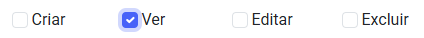

#Perfis de acesso

## Como funciona

Os perfis de acesso são uma das funções regulamentadoras da plataforma. Criamos eles para vinculá-los aos usuários e definir quais são as páginas que eles terão acesso e a quais permissões dentro dessas páginas eles terão. Permitindo a organização a viabilizar as responsabilidades de cada usuário dentro da plataforma, por exemplo:

Um usuário que utilizará a plataforma apenas para o registro de tarefas não precisa ter acesso aos menus de configuração, logo, o seu acesso pode ser limitado apenas ao menu `trabalho` onde ocorre a execução do trabalho:

<figure markdown="span">
 { width="900" }
</figure>

Já um perfil de supervisão, pode ter acesso ao planejamento:

<figure markdown="span">
 { width="900" }
</figure>

Porém, isso não é uma regra. A organização pode definir os acessos de cada usuário conforme achar necessário! :wink:

---

## Como configurar

Clique no menu `Segurança`, acesse `Perfis de acesso` e siga os passos: 

1. Clique em "Adicionar":

2. Defina um nome para o perfil de acesso.

3. Selecione as permissões que este perfil terá em cada tela.

=== "Passo 1" 

    <figure markdown="span">
     { width="900" }
    </figure>

=== "Passo 2"

    <figure markdown="span">
     { width="900" }
    </figure>

=== "Passo 3"

    <figure markdown="span">
     { width="900" }
    </figure>

* Clique em "Salvar" ou "Salvar e voltar" no rodapé da página.

!!! info "Veja bem:"
    Um perfil pode ter a permissão de "Ver" um determinado menu, e ao mesmo tempo, não poder realizar ações dentro dele:
    <figure markdown="span">
     { width="300" }
    </figure>
    Logo, quando ele acessar o menu, poderá visualizar seus conteúdos, porém não terá permissão de alterar, criar ou excluir pois os botões de "Adicionar", "Salvar" ou "Excluir" não estarão disponíveis.

Após criar o perfil de acesso, deve-se incluir os usuários que pertencem ao perfil:

Clique no menu `Segurança`, acesse `Usuários`. Clique em um usuário cadastrado e selecione o perfil desejado no campo:

<figure markdown="span">
 { width="900" }
</figure>

Ou [crie um usuário](users.md)!

---

## Permissões

Nem todas as funções do perfil de acesso se resumem a telas, algumas podem ser sobre permissões específicas dentro daquelas telas, por exemplo:

Para que seja possível um usuário gerar um **Relatório geral de trabalho** no menu `trabalho`, ele deve ter essa permissão no perfil de acesso.
Assim como para importar movimentações do menu `atendimentos`e mais!

---

