# Atendimentos

Menu de criação e consulta de Atendimentos da plataforma. 

!!! info "Atenção"
    Menu em desenvolvimento, é possível que existam mudanças recentes na plataforma. :wink:

## Configuração 

Para que seja possível realizar os registros de atendimento na plataforma, serão necessários alguns passos de configuração.

### Configurando produtos de atendimento

Após a criação dos [produtos](contract_products.md), indicar que sua característica é de atendimento:

No menu `Configurações`, acesse `Produtos do contrato` e siga os passos: 

1. Clique no produto:

    <figure markdown="span">
    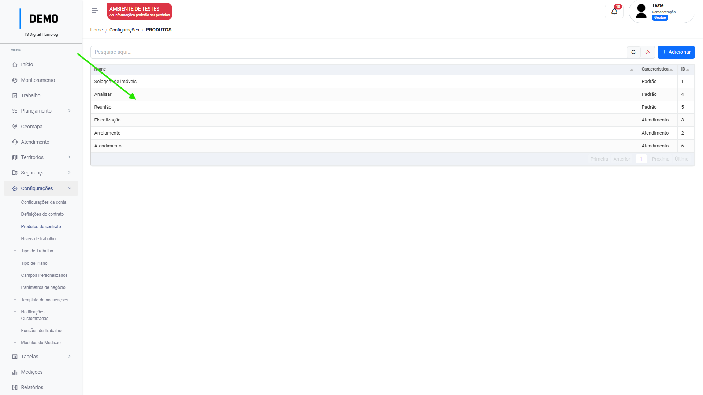{ width="900" }
    </figure>

2. Selecione o campo "Característica do produto" como "Atendimento":

    <figure markdown="span">
    { width="900" }
    </figure>

3. Clique em "Salvar".

4. Crie uma [Ordem de serviço](service_orders.md) e inclua o produto com a característica de "Atendimentos":

    <figure markdown="span">
    { width="900" }
    </figure>

**Este passo é necessário pois em todo registro de atendimento será obrigatório a seleção de uma ordem de serviço. No campo de seleção, só aparecerão listadas as ordens de serviços que possuírem produtos inclusos com a característica de atendimentos.**

---

### Configurando Tabelas 

Os campos de preenchimento dos atendimentos mudarão a partir do `tipo de atendimento` selecionado no registro, para que os campos de seleção exibam as informações corretas, as tabelas devem ser configuradas. 

Campos que são configurados no menu Tabelas:

| Campo       | Tipo de atendimento                                         |       
| ----------- | ----------------------------------------------------------- |
| `Motivo do atendimento`                   | :material-check:     P4, P6   |
| `Canal de atendimento`                    | :material-check:     P4       |
| `Situação do atendimento habitacional`    | :material-check:     P5       |

#### Motivo do atendimento

1. No menu `Tabelas` → `Motivos de atendimento` clique em "Adicionar": 

    <figure markdown="span">
    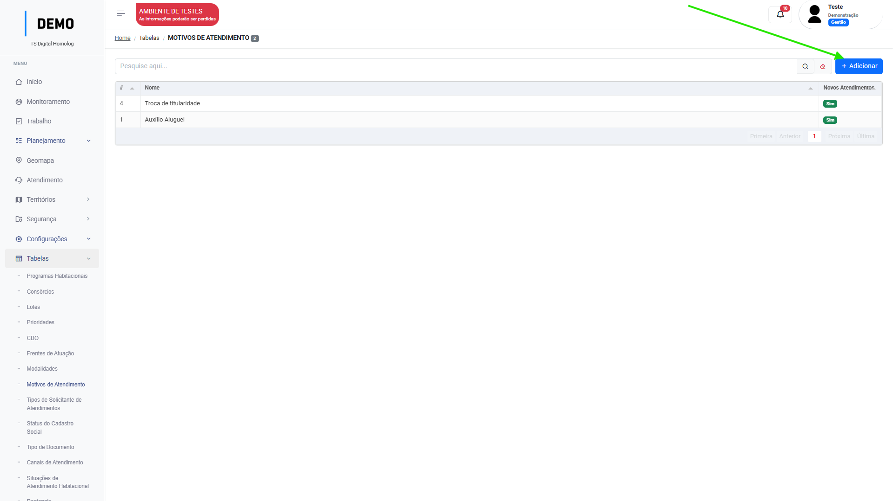{ width="900" }
    </figure>

2. Após inserir o "nome" do valor, ative o switch "_exibir apenas para novos atendimentos_":

    <figure markdown="span">
    { width="900" }
    </figure>

3. Selecione em qual tipo de atendimento este motivo deve aparecer (P4 ou P6):

    <figure markdown="span">
    { width="900" }
    </figure>

4. Clique em "Salvar".

    <figure markdown="span">
    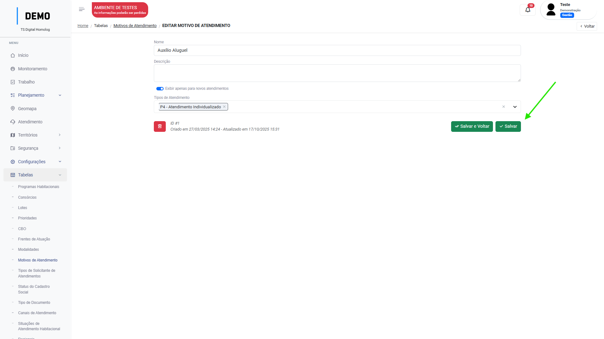{ width="900" }
    </figure>

Pronto! Agora esse valor foi inserido como uma opção de seleção no campo de "motivo do atendimento":

<figure markdown="span">
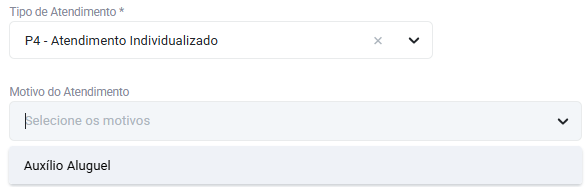{ width="600" }
</figure>

---

#### Canal de atendimento

1. No menu `Tabelas` → `Canais de atendimento` clique em "Adicionar": 

    <figure markdown="span">
    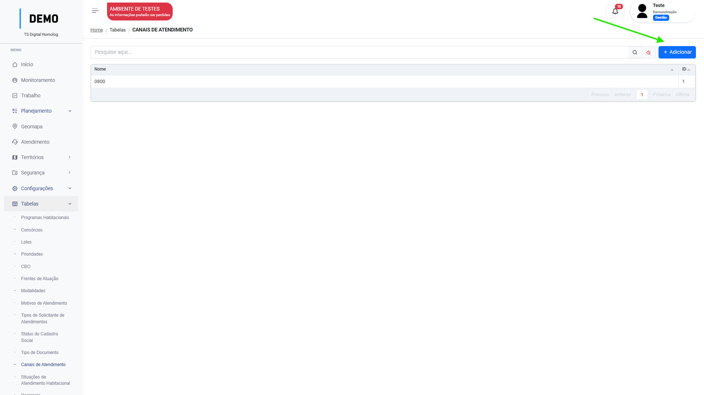{ width="900" }
    </figure>

2. De um nome para o canal e clique em "Salvar".

    <figure markdown="span">
    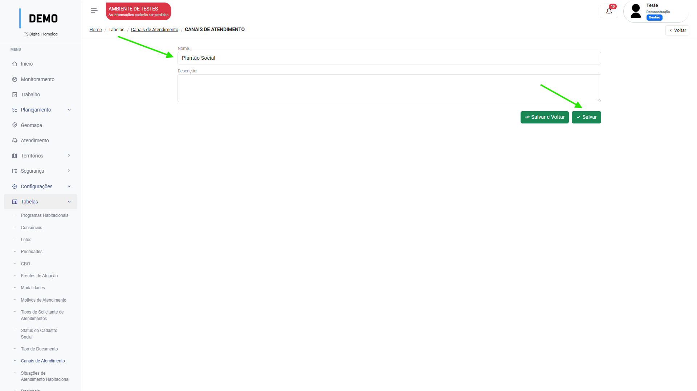{ width="900" }
    </figure>

Pronto! Agora esse valor foi inserido como uma opção de seleção no campo de "Canal de atendimento":

<figure markdown="span">
{ width="600" }
</figure>

---

#### Situação do atendimento habitacional

1. No menu `Tabelas` → `Situações de atendimento habitacional` clique em "Adicionar": 

    <figure markdown="span">
    { width="900" }
    </figure>

2. De um nome para a situação e clique em "Salvar".

    <figure markdown="span">
    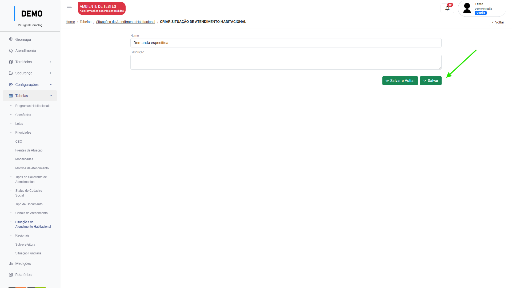{ width="900" }
    </figure>

Pronto! Agora esse valor foi inserido como uma opção de seleção no campo de "Situação de atendimento habitacional":

<figure markdown="span">
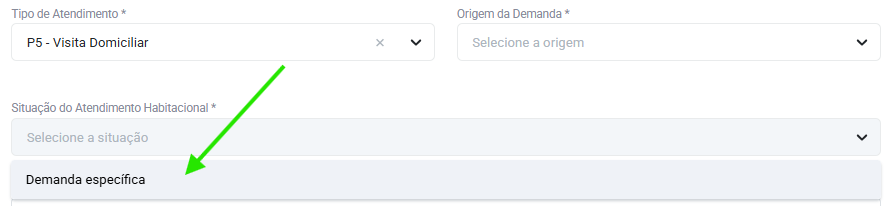{ width="600" }
</figure>

---

## Visualização

O menu conta com três filtros padrões para visualização: 

=== "Caixa de entrada"

    <figure markdown="span">
    { width="900" }
    </figure>

    * Lista os atendimentos sem atendentes atribuídos.

=== "Meus atendimentos"

    <figure markdown="span">
    { width="900" }
    </figure>

    * Lista apenas os atendimentos que o usuário possui como atendente.

=== "Todos"

    <figure markdown="span">
    { width="900" }
    </figure>

    * Lista todos os atendimentos.

O usuário pode escolher também a visualização em lista ou calendário:

=== "Lista"

    <figure markdown="span">
    { width="900" }
    </figure>

=== "Calendário"

    <figure markdown="span">
    { width="900" }
    </figure>

## Como registrar um atendimento

### Atendimento Individualizado (P4)

1. No menu `Atendimentos`, clique em "Adicionar":

    <figure markdown="span">
    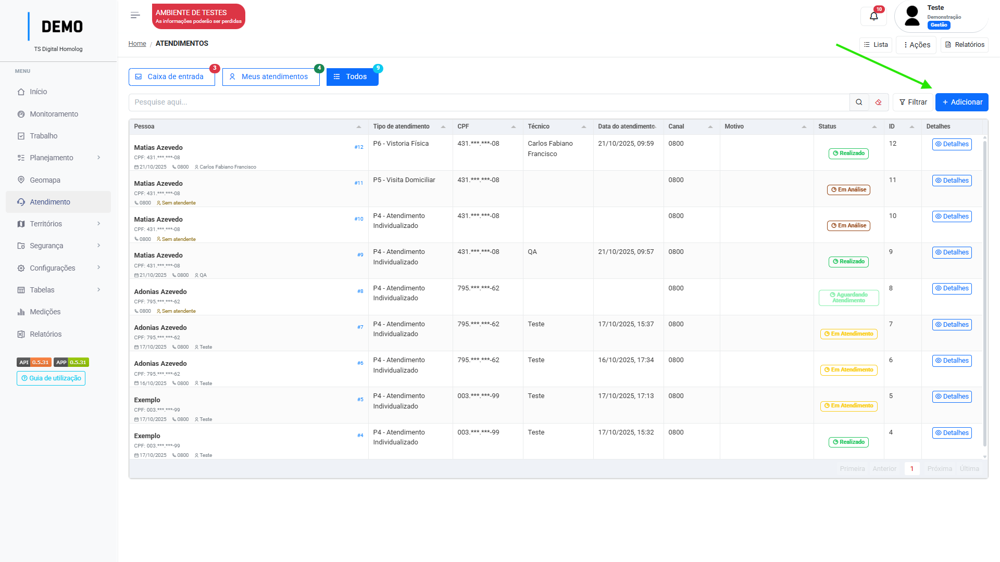{ width="900" }
    </figure>

2. Selecione a ordem de serviço qual o atendimento pertence.

    <figure markdown="span">
    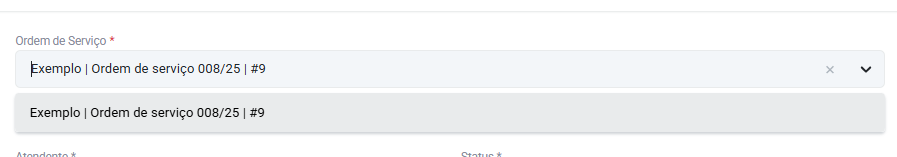{ width="900" }
    </figure>

3. Selecione a pessoa que será atendida ou clique em "Adicionar" caso ela não esteja cadastrada na plataforma.

    <figure markdown="span">
    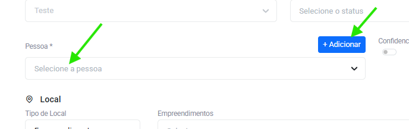{ width="900" }
    </figure>

    !!! tip "Dica"
        Busque pelo nome ou pelo CPF.

4. Selecione o território qual o atendimento pertence:

    <figure markdown="span">
    { width="900" }
    </figure>

5. Selecione a opção "P4 - Atendimento individualizado":

    <figure markdown="span">
    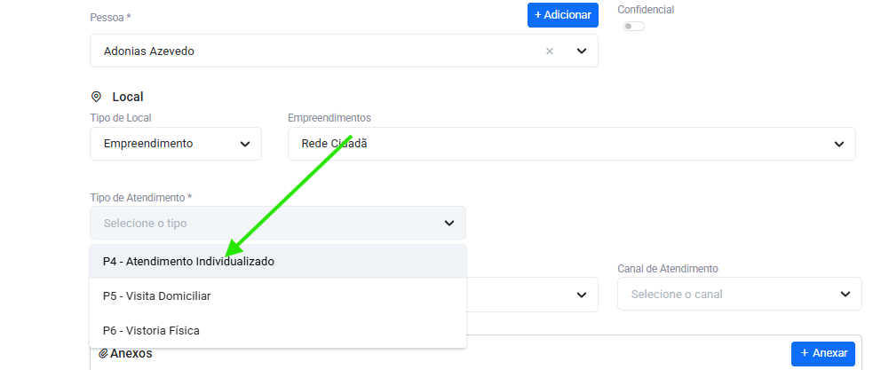{ width="900" }
    </figure>

6. Selecione o motivo e o canal de atendimento:

    <figure markdown="span">
    { width="900" }
    </figure>

7. Digite o detalhamento(síntese) e as providências(encaminhamentos) do atendimento: 

    <figure markdown="span">
    { width="900" }
    </figure>

8. Selecione a data/hora início:

    <figure markdown="span">
    { width="900" }
    </figure>

9. Salve as informações:

    <figure markdown="span">
    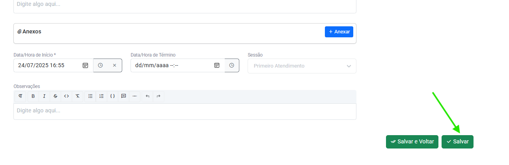{ width="900" }
    </figure>
    
    !!! note "Nota"
        _Após salvar, o usuário ainda pode editar as informações do atendimento caso tenha de editar algum campo_

10. Adicione o(s) [encaminhamento(s)](attendances.md/#encaminhamentos) se necessário:

    <figure markdown="span">
    { width="900" }
    </figure>

11. Revise as informações e conclua o atendimento:

    <figure markdown="span">
    { width="900" }
    </figure>

    !!! info "Anteção"
        _O atendimento agora será concluído e não será possível editar as informações._

---

### Visita Domiciliar (P5)

1. No menu `Atendimentos`, clique em "Adicionar":

    <figure markdown="span">
    { width="900" }
    </figure>

2. Selecione a ordem de serviço qual o atendimento pertence.

    <figure markdown="span">
    { width="900" }
    </figure>

3. Selecione a pessoa que será atendida ou clique em "Adicionar" caso ela não esteja cadastrada na plataforma.

    <figure markdown="span">
    { width="900" }
    </figure>

    !!! tip "Dica"
        Busque pelo nome ou pelo CPF.

4. Selecione o território qual o atendimento pertence:

    <figure markdown="span">
    { width="900" }
    </figure>

5. Selecione a opção "P5 - Visita Domiciliar":

    <figure markdown="span">
    { width="900" }
    </figure>

6. Selecione a "Origem da demanda"

    <figure markdown="span">
    { width="900" }
    </figure>

7. Selecione a "Situação do Atendimento Habitacional":

    <figure markdown="span">
    { width="900" }
    </figure>

8. Digite o "Assunto":

    <figure markdown="span">
    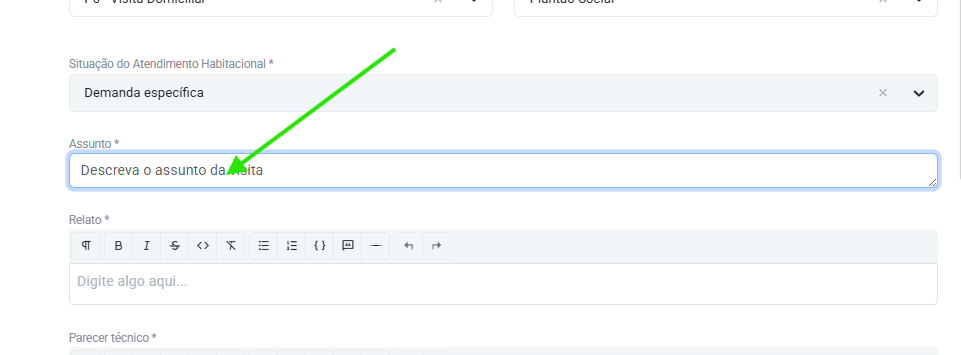{ width="900" }
    </figure>

9. Digite o **Relato** e o **Parecer Técnico** da visita:

    <figure markdown="span">
    { width="900" }
    </figure>

10. Selecione a data/hora início:

    <figure markdown="span">
    { width="900" }
    </figure>

11. Salve as informações:

    <figure markdown="span">
    { width="900" }
    </figure>

    !!! note "Nota"
        _Após salvar, o usuário ainda pode editar as informações do atendimento caso tenha de editar algum campo_

12. Adicione o(s) [encaminhamento(s)](attendances.md/#encaminhamentos) se necessário:

    <figure markdown="span">
    { width="900" }
    </figure>

13. Revise as informações e conclua o atendimento:

    <figure markdown="span">
    { width="900" }
    </figure>

    !!! info "Anteção"
        _O atendimento agora será concluído e não será possível editar as informações._

---

### Vistoria Física (P6)

1. No menu `Atendimentos`, clique em "Adicionar":

    <figure markdown="span">
    { width="900" }
    </figure>

2. Selecione a ordem de serviço qual o atendimento pertence.

    <figure markdown="span">
    { width="900" }
    </figure>

3. Selecione a pessoa que será atendida ou clique em "Adicionar" caso ela não esteja cadastrada na plataforma.

    <figure markdown="span">
    { width="900" }
    </figure>

    !!! tip "Dica"
        Busque pelo nome ou pelo CPF.

4. Selecione o território qual o atendimento pertence:

    <figure markdown="span">
    { width="900" }
    </figure>

5. Selecione a opção "P6 - Vistoria Física":

    <figure markdown="span">
    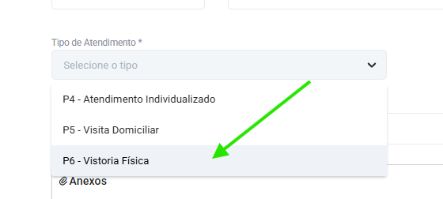{ width="900" }
    </figure>

6. Selecione a "origem da demanda":

    <figure markdown="span">
    { width="900" }
    </figure>

7. Selecione o "motivo" do atendimento:

    <figure markdown="span">
    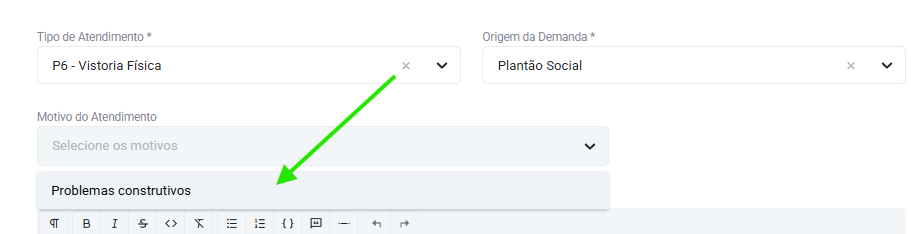{ width="900" }
    </figure>

8. Descreva o **Relato**:

    <figure markdown="span">
    { width="900" }
    </figure>

9. Selecione a data/hora início:

    <figure markdown="span">
    { width="900" }
    </figure>

10. Salve as informações:

    <figure markdown="span">
    { width="900" }
    </figure>

    !!! note "Nota"
        _Após salvar, o usuário ainda pode editar as informações do atendimento caso tenha de editar algum campo_

11. Adicione o(s) [encaminhamento(s)](attendances.md/#encaminhamentos) se necessário:

    <figure markdown="span">
    { width="900" }
    </figure>

12. Revise as informações e conclua o atendimento:

    <figure markdown="span">
    { width="900" }
    </figure>

    !!! info "Anteção"
        _O atendimento agora será concluído e não será possível editar as informações._

---

