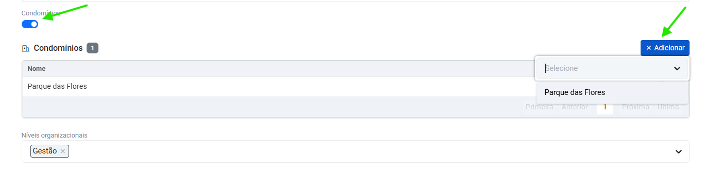

# Condomínios

Menu de cadastro de condomínios.

Os condomínios cadastrados aqui podem ser adicionados como condomínios dos empreendimentos.

## Como cadastrar um condomínio

Clique no menu `Territórios`, acess `Condomínios` e clique em "adicionar".

Em seguida, insira o nome do condomínio e a quantidade de unidades habitacionais que ele possue:

<figure markdown="span">
 { width="900" }
</figure>

Clique em "Adicionar bloco" para detalhar quantos blocos aquele condomínio possui e quantas unidades cada um tem:

<figure markdown="span">
 { width="900" }
</figure>

---

## Como adicionar condomínios aos Empreendimentos 

No menu `Territórios`, acesse `Empreendimentos`.

Selecione um Empreendimento ou [adicione](enterprises.md/#como-cadastrar-um-empreendimento) um.

Ao final da página, o bloco de adição dos condomínios estará disponível, ative o switch.
 
Clique em "Adicionar" e selecione o condomínio cadastrado previamente:

<figure markdown="span">
 { width="600" }
</figure>

* Clique em salvar.

---