# Campos personalizados 

Os campos personalizados são campos parametrizados pelo usuário na plataforma, ficando a seu critério o tipo de preenchimento que será feito nas tarefas.

São vinculados ao `Tipo de trabalho`.

## Como criar campos personalizados

1. Clique em "Adicionar".

2. Defina um nome interno para o campo personalizado.
    O campo "Label" será o título do campo visível nas tarefas.

3. Selecione o tipo do campo.

=== "Passo 1"

    <figure markdown="span">
     { width="900" }
    </figure>

=== "Passo 2"

    <figure markdown="span">
     { width="900" }
    </figure>

=== "Passo 3"

    <figure markdown="span">
     { width="900" }
    </figure>

* Dependendo do tipo de campo selecionado, a plataforma abrirá a configuração daquele campo:

<figure markdown="span">
 { width="900" }
</figure>

* Repare que no exemplo, ao selecionar o tipo "número" o sistema me possibilita especificar o número de casas decimais.

* Clique em "Salvar" ou "Salvar e voltar".

## Tipos de campo

Definição de que tipo de dados que aquele campo personalizado receberá, a plataforma conta com os seguintes campos:

### Arquivo

Campo de adição de arquivos.

??? example "Exemplo"   

    <figure markdown="span">
    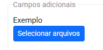{ width="300" }
    </figure>

### Checkbox

Ao selecionar o tipo [checkbox]("caixa de seleção"), o usuário deve adicionar quais opções de seleção haverão disponíveis. **Este tipo permite multiplas escolhas**.

1. Clique em "Adicionar opções"

    <figure markdown="span">
    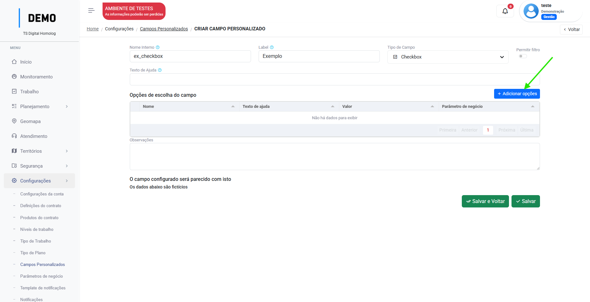{ width="900" }
    </figure>

2. Defina uma identificação para a opção.

    <figure markdown="span">
    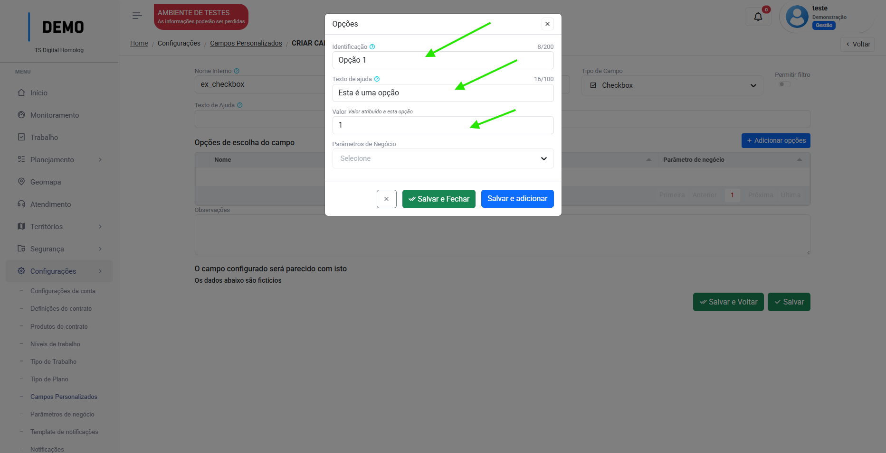{ width="900" }
    </figure>

_Você pode inserir um texto de ajuda para facilitar o preenchimento como no exemplo: [texto de ajuda]("Aparecerá assim")._

_Você pode adicionar um [`Parâmetro de negócio`](business_params.md) aquela opção._

Clique em "Salvar" ou "Salvar e adicionar" para adicionar mais opções.

??? example "Exemplo"   
    
    <figure markdown="span">
    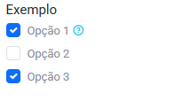{ width="300" }
    </figure>

### Data

Campo de data simples.

??? example "Exemplo"   
    
    <figure markdown="span">
    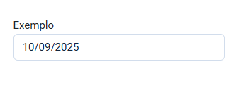{ width="300" }
    </figure>

### Data e hora

Campo de data e hora.

??? example "Exemplo"   

    <figure markdown="span">
    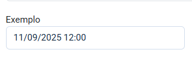{ width="300" }
    </figure>

### Hora

Campo de hora simples.

??? example "Exemplo"   

    <figure markdown="span">
    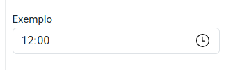{ width="300" }
    </figure>    

### Número

Campo que recebe apenas dados numéricos.  

Você pode definir quantas casas decimais o campo suporta, e ativar o separador de milhar:

<figure markdown="span">
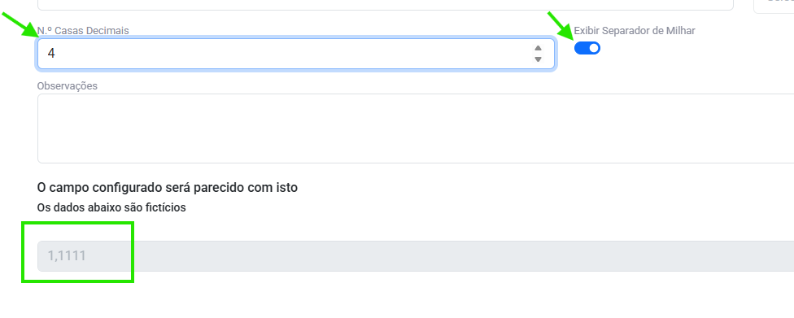{ width="600" }
</figure>

??? example "Exemplo"   

    <figure markdown="span">
    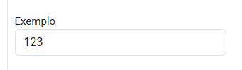{ width="300" }
    </figure>

### Orientação

Campo que exibirá o texto definido na configuração do campo personalizado. Por exemplo, para orientar como o usuário deve preencher aquela tarefa.

??? example "Exemplo"   
    
    <figure markdown="span">
    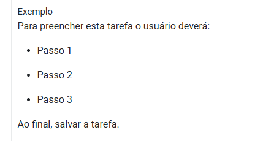{ width="300" }
    </figure>

### Radio

Ao selecionar o tipo `Radio` o usuário deve adicionar quais opções de seleção haverão disponíveis. **Este campo é de escolha única**

Configurado da mesma forma que o [checkbox](custom_fields.md/#checkbox).

??? example "Exemplo"   

    <figure markdown="span">
    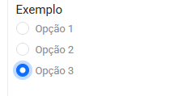{ width="300" }
    </figure>

### Select

Ao selecionar o tipo `Select`  o usuário deve adicionar quais opções de seleção haverão disponíveis. **Este campo é de escolha única**

Configurado da mesma forma que o [checkbox](custom_fields.md/#checkbox).

??? example "Exemplo"   

    <figure markdown="span">
    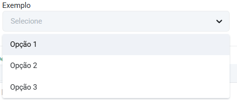{ width="300" }
    </figure>

### Texto curto

Campo de inserção de texto curto, suporta poucos caracteres simples.

??? example "Exemplo"   

    <figure markdown="span">
    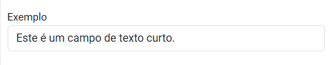{ width="300" }
    </figure>

### Texto longo

Campo de inserção de texto longo, suporta grandes quantidades de texto simples.

??? example "Exemplo"   

    <figure markdown="span">
    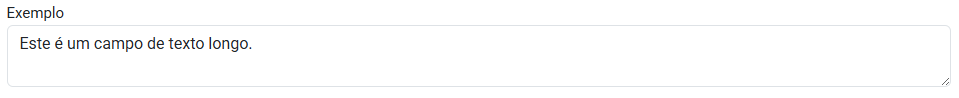{ width="600" }
    </figure>

### Texto formatado 

Campo de inserção de dados formatáveis, como **negrito**, _itálico_, parágrafos etc.

??? example "Exemplo"   

    <figure markdown="span">
    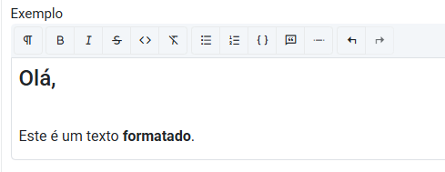{ width="300" }
    </figure>

---

## Filtro

É possível aplicar o switch "permitir filtro" para que no menu trabalho, o usuário possa buscar tarefas pelos campos personalizados presentes em seu tipo de trabalho:

<figure markdown="span">
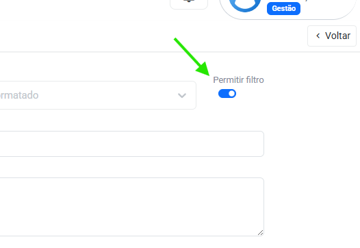{ width="300" }
</figure>

---