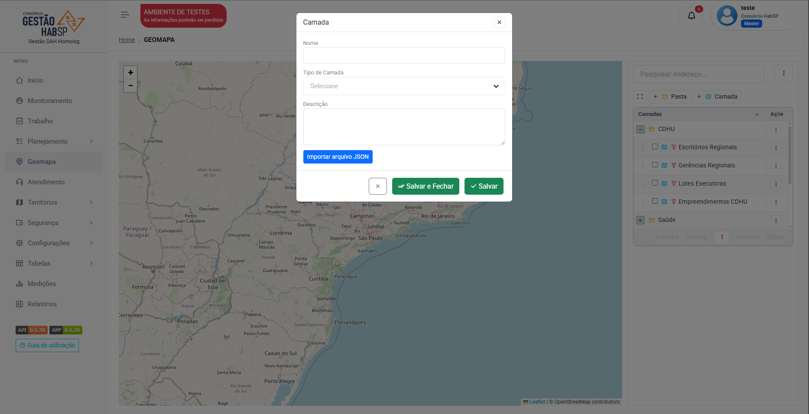

# Geomapa 

O Geomapa é uma mapa digital integrado na plataforma para a visualização de indicadores.

A importação dos marcadores são feitas a partir de arquivos _JSON_ 

Basta clicar em "Camada" para adicionar:

<figure markdown="span">
{ width="300" }
</figure>

Dê o nome, selecione o tipo da camada e clique em "Importar arquivo JSON":

<figure markdown="span">
{ width="900" }
</figure>

---

## Edição

Você pode editar as informações da camada clicando nos três pontos:

<figure markdown="span">
{ width="300" }
</figure>

Clique em "Editar" para abrir a opção de editar o Nome e o Tipo de camada.

### Tipo de camada

Marcador = Camada que cobrirá a área indicada do arquivo:

<figure markdown="span">
{ width="600" }
</figure>

Polígono = Pontos específicos indicados no arquivo:

<figure markdown="span">
{ width="600" }
</figure>

### Legendas

Clique nos três pontos da camada e selecione "legenda":

<figure markdown="span">
{ width="600" }
</figure>

Selecione o título da legenda e edite suas cores.  

O "ícone" só estará disponível se sua camada for um **polígono**.

Ative o switch para visualizar a legenda no geomapa:

<figure markdown="span">
{ width="300" }
</figure>

---

## Exportar mapa 

Clique nos três pontos para baixar a imagem das camadas nos formatos JPEG e PDF 

<figure markdown="span">
{ width="300" }
</figure>

---