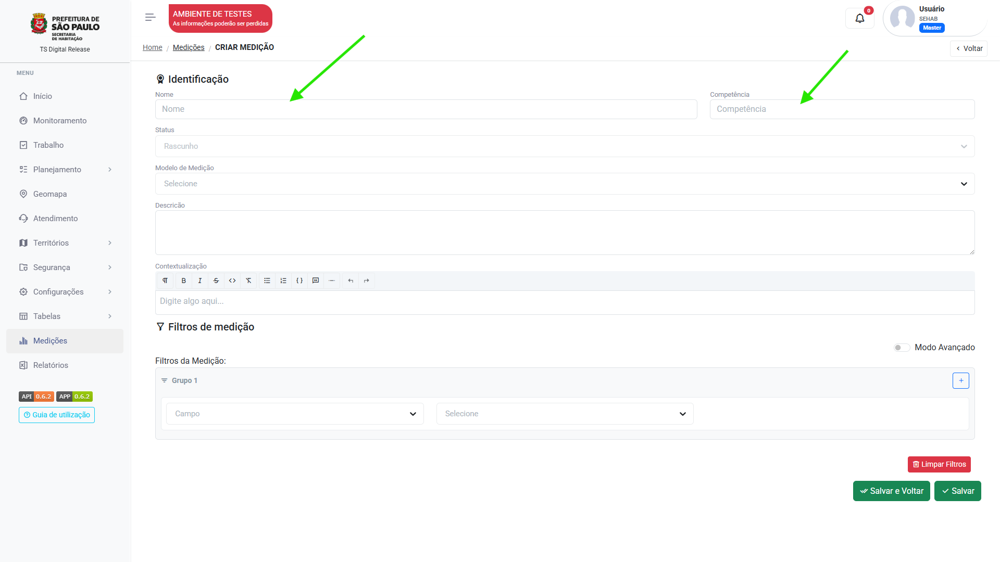
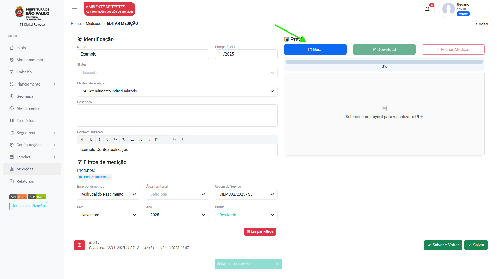

# Medições

## Como criar uma medição

1. No meu `Medições` clique em "Adicionar":

    <figure markdown="span">
    { width="900" }
    </figure>
    
2. Insira o nome da medição e a competência:

    <figure markdown="span">
    { width="900" }
    </figure>,

3. Selecione o [modelo de medição](measurement_templates.md):

    <figure markdown="span">
    { width="900" }
    </figure>

4. Escreva a contextualização do trabalho: 

    <figure markdown="span">
    { width="900" }
    </figure>

5. Selecione os filtros de qual área/ mês/ ano a medição será gerada:

    <figure markdown="span">
    { width="900" }
    </figure>

6. Clique em "Salvar" para exibir a pré-visualização:

    <figure markdown="span">
    { width="900" }
    </figure>

7. Clique em "Gerar" para gerar a medição:

    <figure markdown="span">
    { width="900" }
    </figure>

Pronto! Você pode alterar os filtros e clicar em "Reprocessar" para refazer a medição ou clicar em "Fechar medição" para finalizar o processo.