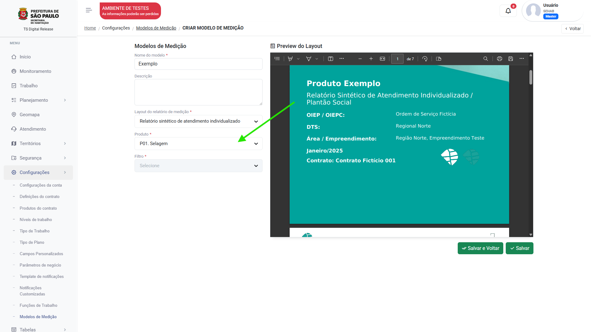

# Modelos de medição

## Criando modelos de medição 

Clique no menu `Configurações`, acesse `Modelos de medição` e siga os passos:

1. Clique em "Adicionar":

    <figure markdown="span">
     { width="900" }
    </figure>

2. Insira o nome do modelo:

    <figure markdown="span">
     { width="900" }
    </figure>

3. Selecione o Layout da medição, uma pré-visualização será exbida ao lado:

    <figure markdown="span">
     { width="900" }
    </figure>

4. Selecione o produto que será medido:

    <figure markdown="span">
     { width="900" }
    </figure>

5. Selecione que tipo de filtro será utilizado neste modelo:

    <figure markdown="span">
     { width="900" }
    </figure>

**Filtro estático:** Trará opções de filtro predefinidas pelo modelo de medição.

**Filtro dinâmico:** Trará todas as opções do filtro dinâmico.

