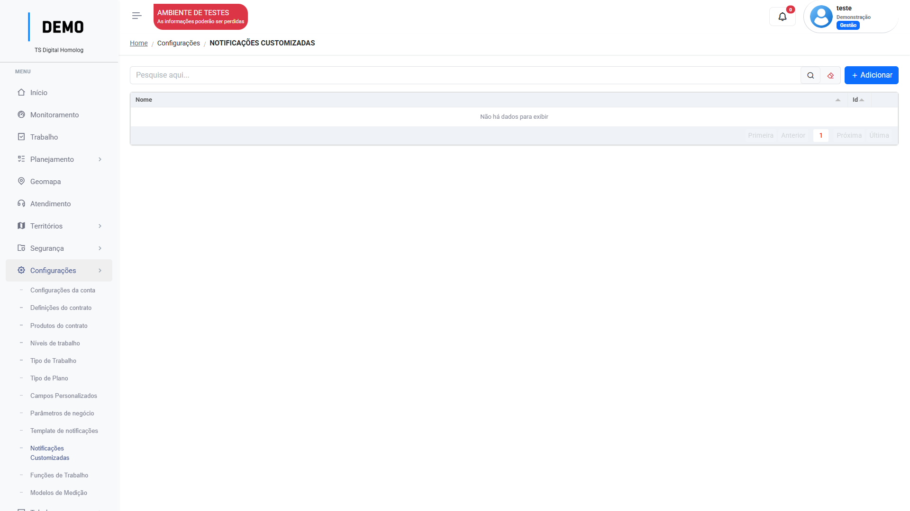
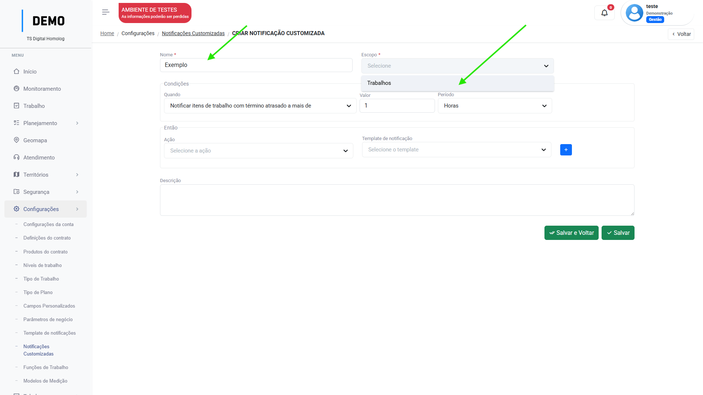
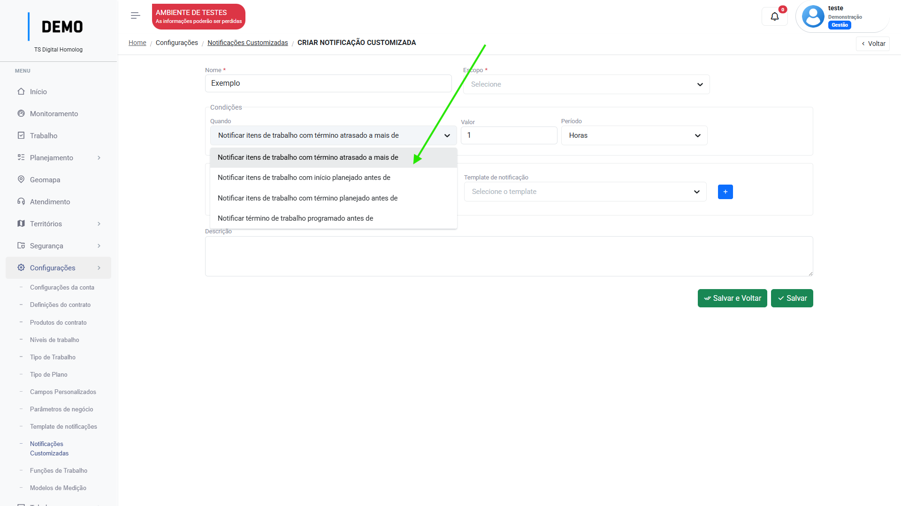
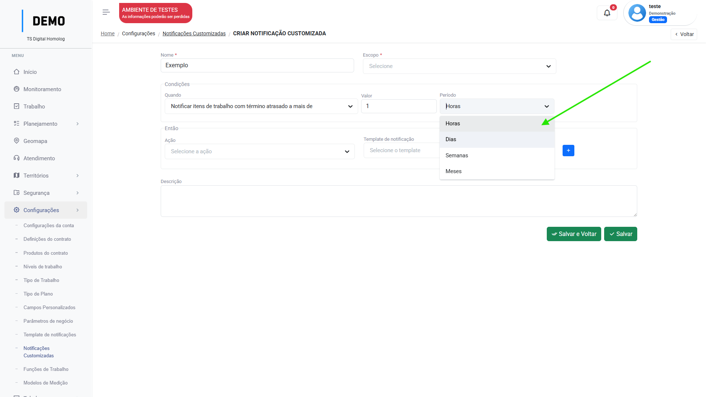
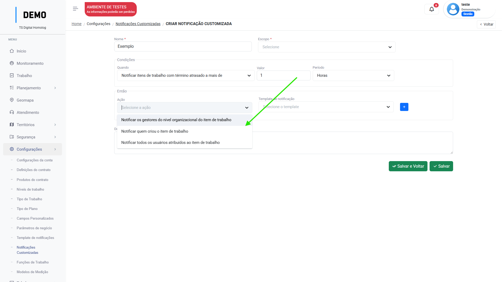
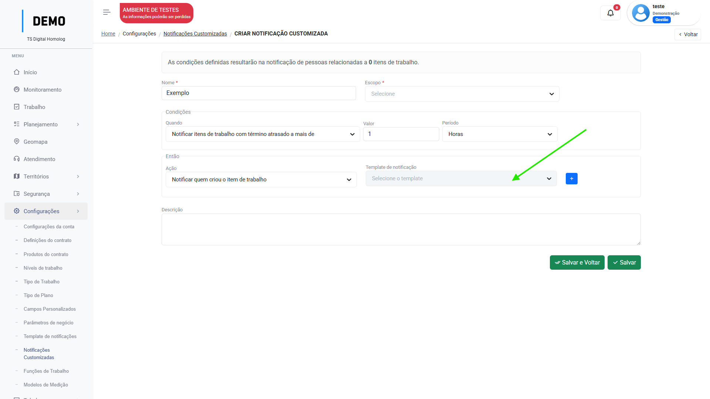

# Notificações customizadas

Menu de configuração das notificações cutomizadas.

Neste menu, você pode criar notificações por exemplo, para alertar aos usuários de que uma tarefa está atrasada, ou mesmo os gestores de um nível.

## Como criar uma notificação customizada

No menu `Configurações`, acesse `Notificações customizadas` e siga os passos:

1. Clique em "Adicionar":

    <figure markdown="span">
    { width="900" }
    </figure>

2. Insira um nome para a notificação e selecione o [escopo]("referência da notificação").
   
    <figure markdown="span">
    { width="900" }
    </figure>

    !!! info
        No momento, somente o escopo de "trabalhos" está disponível para notificações.

3. Configure as condições da notificação:
    
    <figure markdown="span">
    { width="900" }
    </figure>

    _Atente-se aos operadores "a mais de", "antes de"._

    <figure markdown="span">
    { width="900" }
    </figure>

4. Configure a ação da notificação:

    <figure markdown="span">
    { width="900" }
    </figure>

5. Selecione o [`template`](notification_templates.md/#como-configurar-os-modelos-de-notificacao).

    <figure markdown="span">
    { width="900" }
    </figure>

    _Note que o usuário pode inserir mais de uma ação clicando no "+"_.

6. Clique em "Salvar". 

---