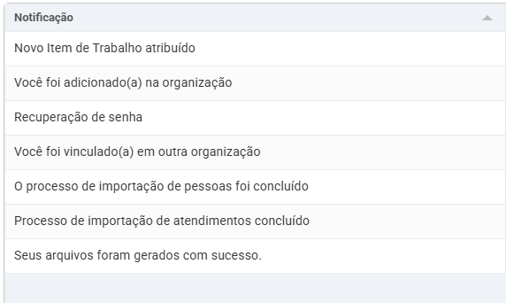
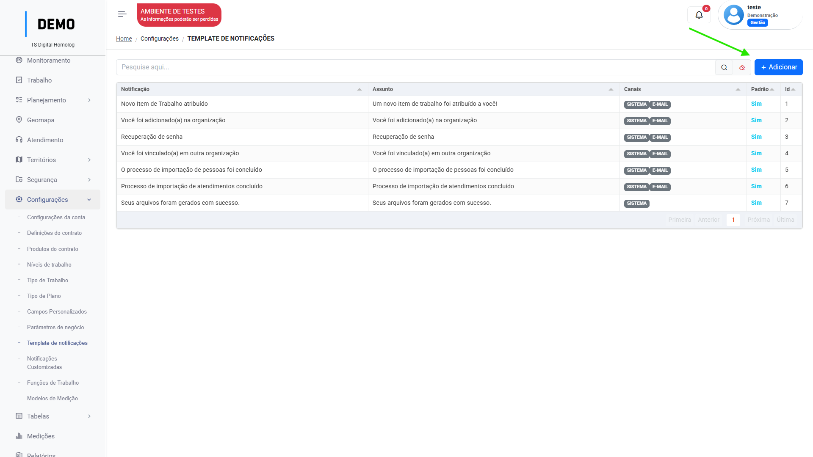
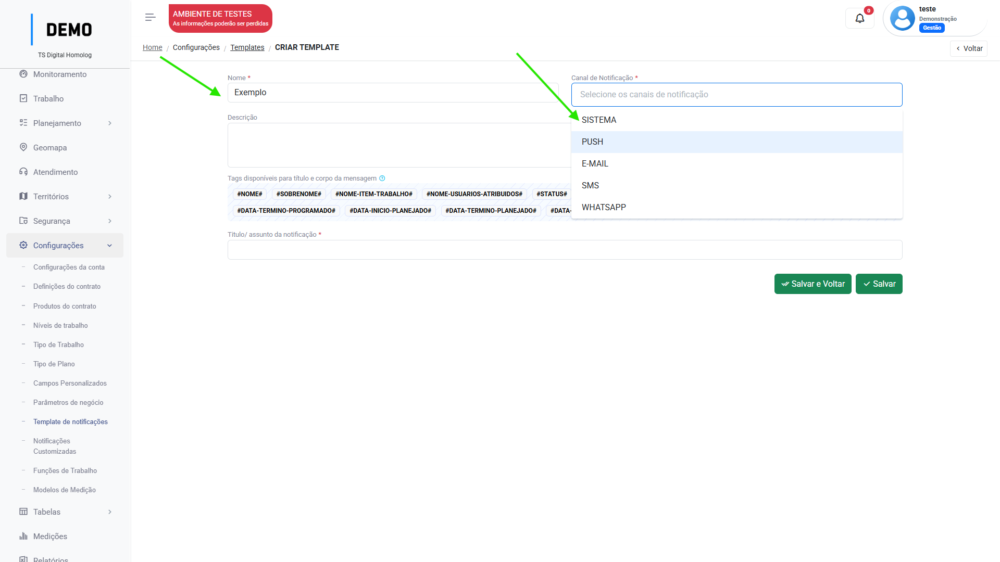
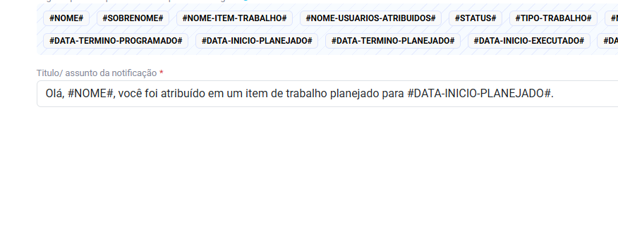
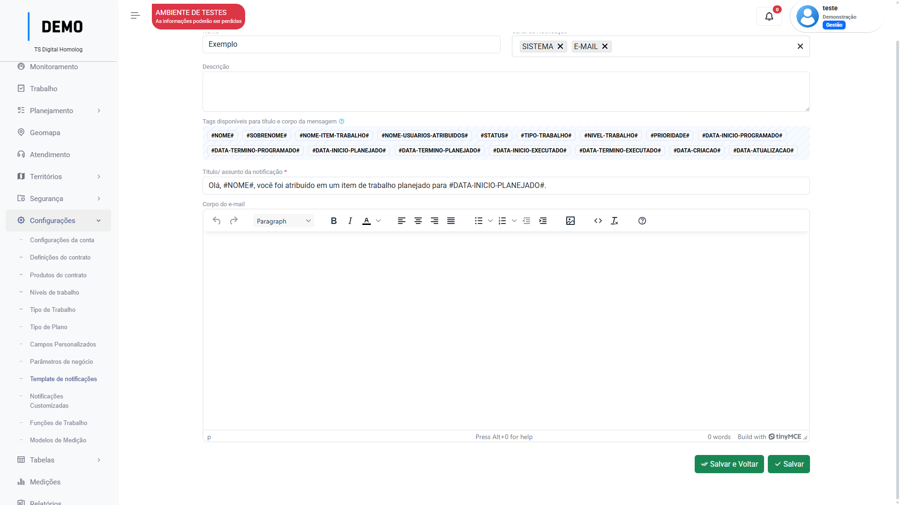

# Template de notificações 

Menu de configuração dos modelos de notifições.  

A plataforma conta com algumas notificações nativas:

<figure markdown="span">
{ width="600" }
</figure>

Neste menu, o usuário pode editar como essas notificações irão funcionar, ou criar modelos de notificação para serem utilizados no menu [`Notificações customizadas`](notification_customs.md). 

## Como configurar os modelos de notificação

No menu `Configurações`, acesse `Template de notificações` e siga os passos:

1. Clique em "Adicionar".

2. Insira um nome para a notificação e o canal(por onde a notificação chegará ao usuário)


    === "Passo 1"

        <figure markdown="span">
        { width="900" }
        </figure>

    === "Passo 2"

        <figure markdown="span">
        { width="900" }
        </figure>


3. Para inserir o título/ assunto na notificação, há uma série de _tags_ que podem ser utilizadas para personalizar a notificação: 

    ```markdown

    #NOME#
    #SOBRENOME#
    #NOME-ITEM-TRABALHO#
    #NOME-USUARIOS-ATRIBUIDOS#
    #STATUS#
    #TIPO-TRABALHO#
    #NIVEL-TRABALHO#
    #PRIORIDADE#
    #DATA-INICIO-PROGRAMADO#
    #DATA-TERMINO-PROGRAMADO#
    #DATA-INICIO-PLANEJADO#
    #DATA-TERMINO-PLANEJADO#
    #DATA-INICIO-EXECUTADO#
    #DATA-TERMINO-EXECUTADO#
    #DATA-CRIACAO#
    #DATA-ATUALIZACAO#

    ```

    Exemplo de preenchimento do título/assunto: 

    <figure markdown="span">
    { width="600" }
    </figure>

    Saída: _Olá, usuário, você foi atribuído em um item de trabalho planejado para XX/XX/XX._

4. Dependendo do canal de notificação que o usuário selecionar, deve ser preenchido o "corpo" da notificação, para SMS e email, por exemplo.

    <figure markdown="span">
    { width="900" }
    </figure>

     _Compatível com HTML para o corpo do email._

5. Clique em "Salvar".

**Caso queira editar uma notificação já existente no sistema, basta selecioná-la no menu de `templates de notificação` e repetir os mesmos passos.**