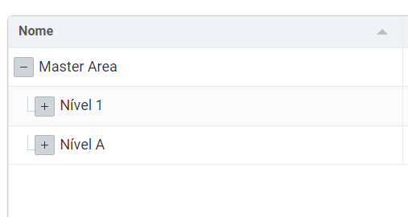
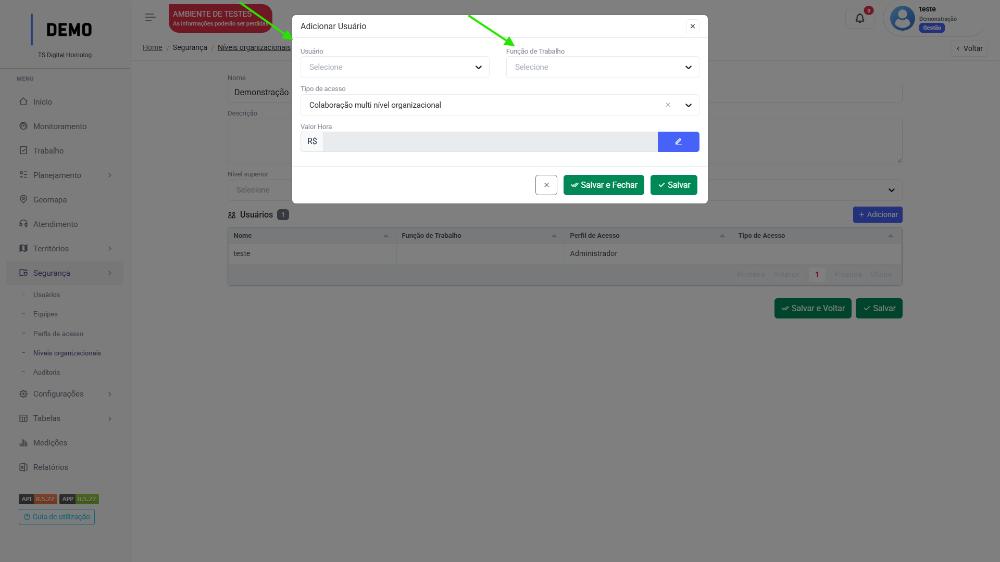
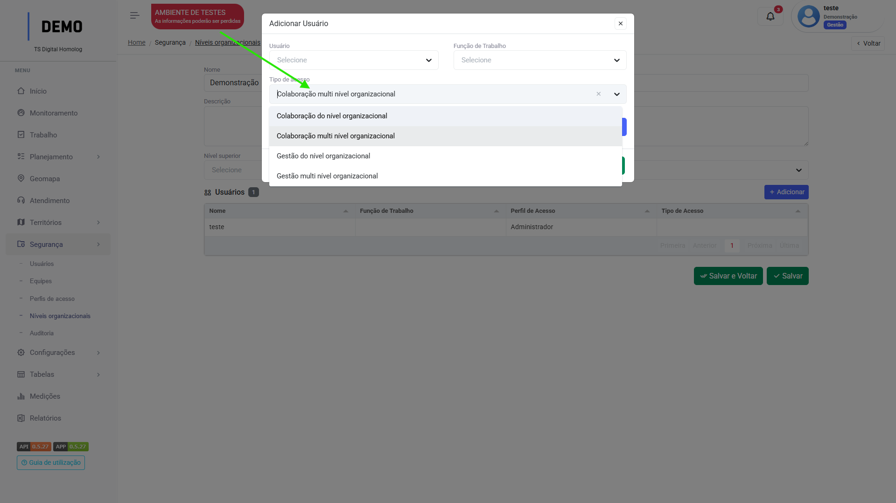

# Níveis organizacionais

## Como funciona

Os níveis organizacionais são uma forma de regulamentar o acesso a **dados** dos usuários na plataforma. Por exemplo, se os usuários são de gerências diferentes dentro de uma organização, cada um só vai ter acesso aos dados que pertecem aquela gerência, para evitar a poluição de dados e o registro errôneo dentro da plataforma.
Porém, eles funcionam como uma "Hierarquia", veja o exemplo abaixo:

<figure markdown="span">
 { width="300" }
</figure>

* Neste exemplo, os usuários do Nível 1 e Nível A enxergam cada um seus respectivos dados, enquanto o usuário que está no "Master Area" enxerga os dados do seu nível e dos dois abaixo.

Diversos menus possuem Níveis organizacionais, como as Áreas terriroiais e Empreendimentos, os menus de Planejamento, para que cada usuário visualize somente aquilo que lhe convém.

---

## Como criar níveis organizacionais

Clique no menu `Segurança`, acesse `Níveis organizacionais` e siga os passos:

1. Clique em "Adicionar".

2. Defina um nome para o nível que está criando. (Campo descrição é opcional).

3. No campo "Nível superior", selecione se o nível que está criando pertence a alguma hierarquia.

=== "Passo 1"

    <figure markdown="span">
     { width="900" }
    </figure>

=== "Passo 2"

    <figure markdown="span">
     { width="900" }
    </figure>

=== "Passo 3"

    <figure markdown="span">
     { width="900" }
    </figure>

* Adicione os usuários que pertencem aquele nível organizacional no botão "Adicionar".

<figure markdown="span">
 { width="900" }
</figure>

* Selecione o usuario e sua [função de trabalho](job_functions.md).

<figure markdown="span">
 { width="900" }
</figure>

* Selecione seu `tipo de acesso`:

<figure markdown="span">
 { width="900" }
</figure>

* Clique em "Salvar e fechar".

Repita os passos até que todos os usuários desejados sejam adicionados.

---

## Tipo de Acesso
