# Relatórios

Menu de criação de relatórios dinâmicos. 

## Como criar um relatório dinâmico

Acesse o menu `Relatórios` e siga os passos:

1. Clique em "Adicionar":

    <figure markdown="span">
    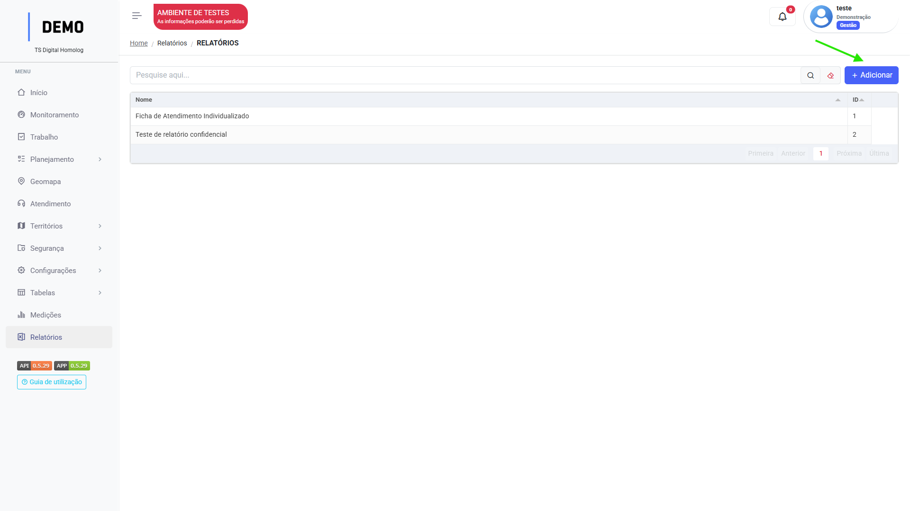{ width="900" }
    </figure>

2. Insira o nome do Relatório:

    <figure markdown="span">
    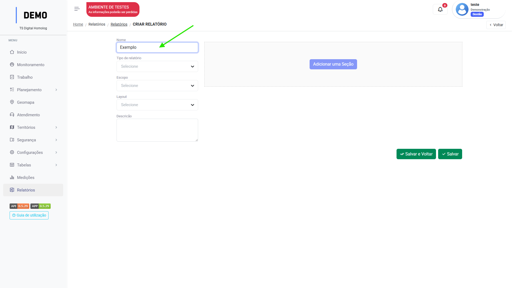{ width="900" }
    </figure>

3. Selecione o tipo de relatório:

    <figure markdown="span">
    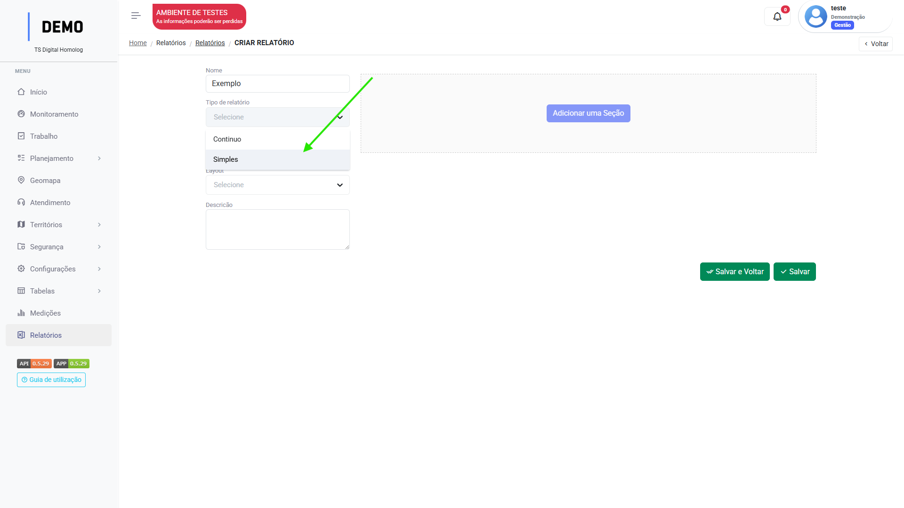{ width="900" }
    </figure>

    **Simples**: Relatório com base em uma tarefa.  

    **Contínuo**: Relatório com base em várias tarefas.

4. Selecione o escopo do relatório:

    <figure markdown="span">
    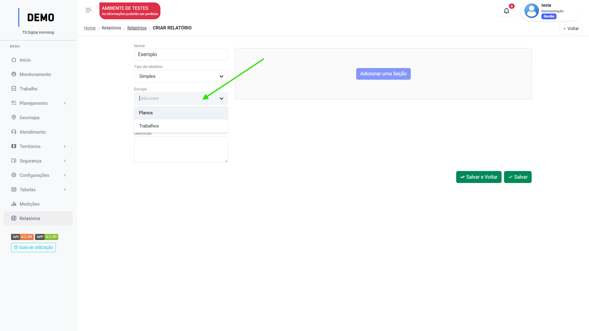{ width="900" }
    </figure>

    **Trabalho**: Relatóio com base no menu `trabalho`.  
    **Planos**: Relatório com base no menu `planejamento`.

5. Selecione a orientação do layout:

    <figure markdown="span">
    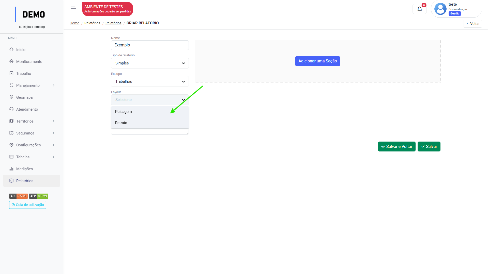{ width="900" }
    </figure>

---

### Simples (Escopo trabalho)

1. Clique em "Adicionar uma seção".

    <figure markdown="span">
    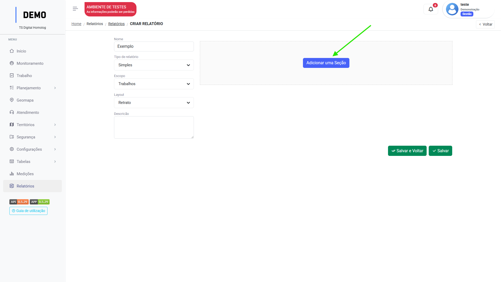{ width="900" }
    </figure>

2. Clique na sessão para adicionar uma linha:

    <figure markdown="span">
    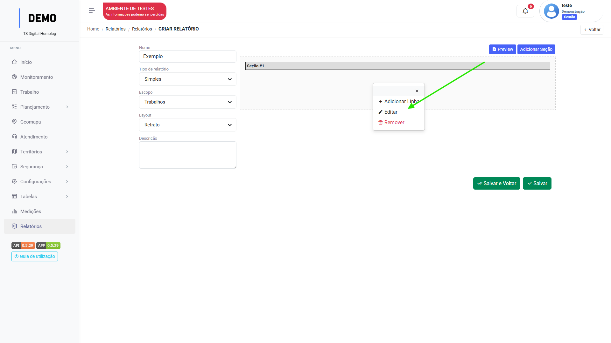{ width="900" }
    </figure>

    _Você pode clicar em "Editar" para mudar o nome de Seção#1_

3. Clique em "Adicionar Coluna":

    <figure markdown="span">
    { width="900" }
    </figure>

4. Insira a largura e altura da coluna:

    <figure markdown="span">
    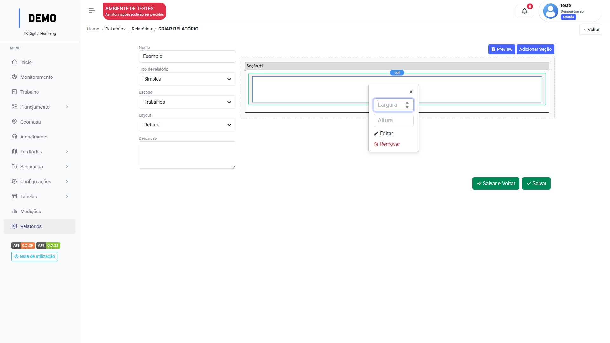{ width="900" }
    </figure>

    _Largura máx: 12_

5. Clique em "Editar" para configurar quais dados que vão compor aquela coluna.

    <figure markdown="span">
    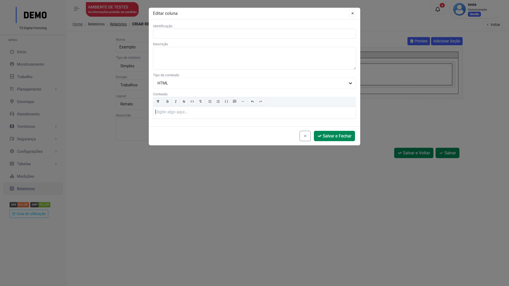{ width="900" }
    </figure>

6. Identifique a coluna e seu tipo de conteúdo:

    <figure markdown="span">
    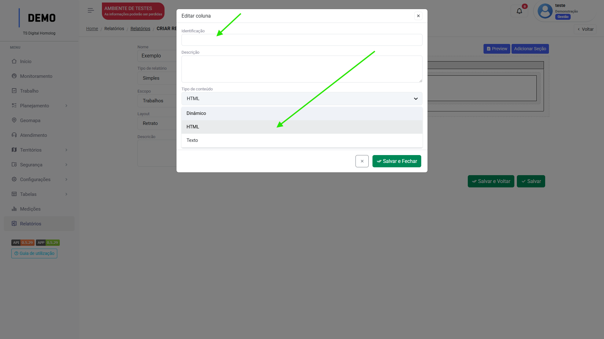{ width="900" }
    </figure>

Clique em "Salvar".

!!! warning "Atenção"

    No menu [`Tipo de trabalho`](work_item_types.md), adicione o relatório na seção **Relatórios disponíveis** para que seja possível sua extração.

## Tipos de conteúdo

Ao configurar os dados que serão exibidos em uma coluna do relatório, deve-se selecionar o tipo de conteúdo daquela coluna, sendo:

1. Texto  
2. HTML 
3. Dinâmico 

### Texto

O tipo de conteúdo "Texto" irá abrir um campo de preenchimento para que o usuário insira as informações que irão compor aquela coluna no formato de texto:

<figure markdown="span">
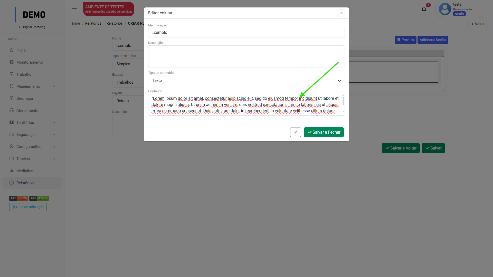{ width="900" }
</figure>

Saída no relatório: 

<figure markdown="span">
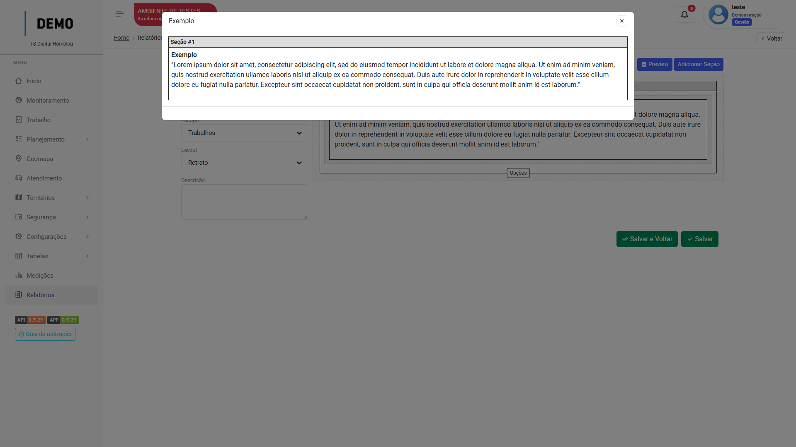{ width="900" }
</figure>

_Clique em "Preview" para visualizar a saída_

### HTML

O tipo de conteúdo "HTML" irá abrir um campo de preenchimento para que o usuário insira as informações que irão compor aquela coluna como texto _formatável_:

<figure markdown="span">
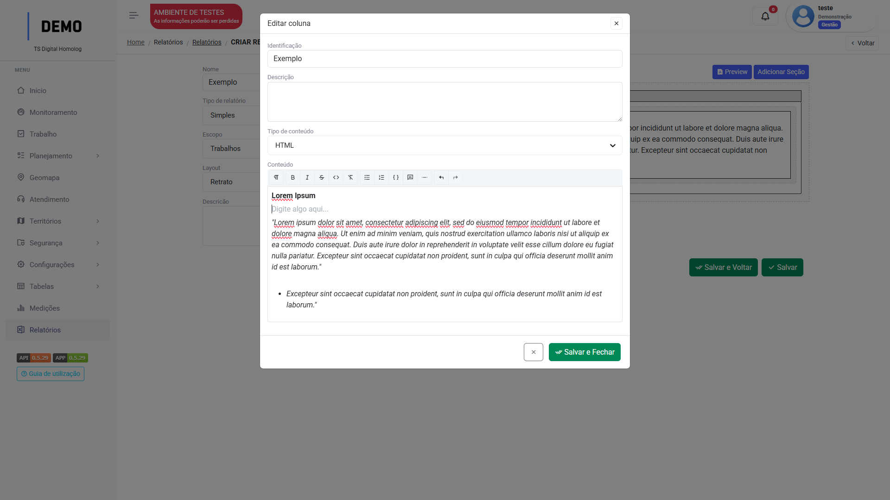{ width="900" }
</figure>

Saída no relatório:

<figure markdown="span">
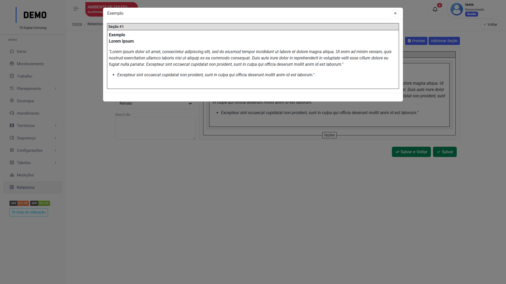{ width="900" }
</figure>

_Clique em "Preview" para visualizar a saída_

### Dinâmico

O tipo de conteúdo "Dinâmico" irá abrir o campo de seleção "fonte", para que seja selecionada a fonte de extração de dados daquela coluna.

<figure markdown="span">
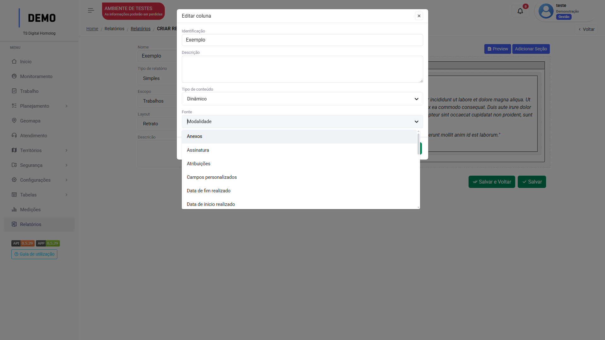{ width="900" }
</figure>

Por exemplo, ao selecionar a fonte "Atribuições", quando o usuário extrair o relatório de uma tarefa, naquela coluna todos os usuários atribuídos na tarefa serão listados:

<figure markdown="span">
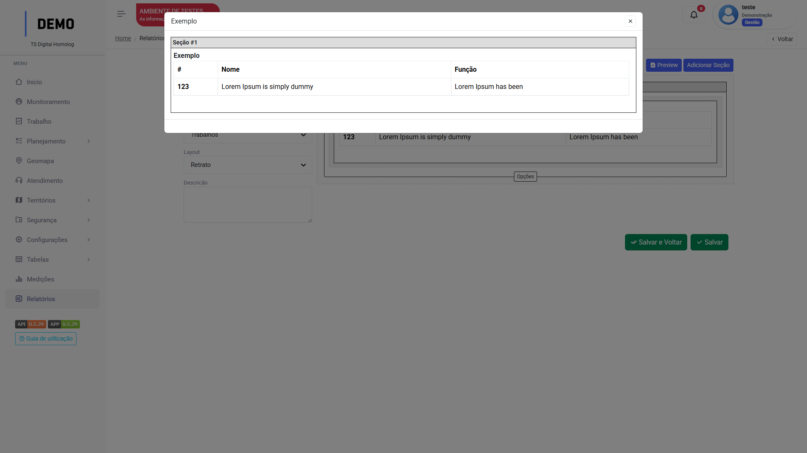{ width="900" }
</figure>

_Clique em "Preview" para visualizar a saída_

---

## Extrair relatório dinâmico

### Da tarefa

Após alterar o Status da tarefa para concluído, o botão de "Relatórios" será disponibilizado na tela:

<figure markdown="span">
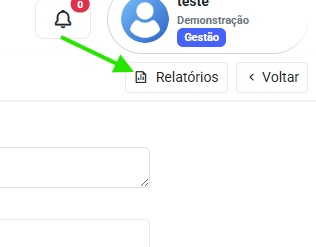{ width="300" }
</figure>

Clique e selecione o relatório desejado.  
Uma Preview irá abrir com a opção de "imprimir" ou "Exportar PDF":

<figure markdown="span">
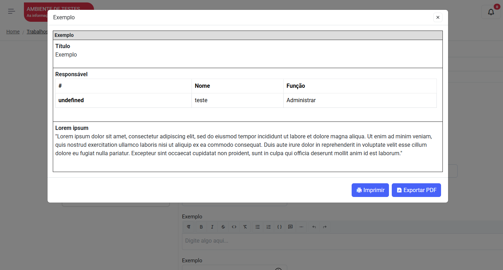{ width="300" }
</figure>

Clique na opção desejada.

!!! Warning "Atenção"
    Para que um usuário possa extrair um relatório dinâmico, o relatório deve ser habilitado para extração em seu [`Perfil de Acesso`](access_levels.md).

---

!!! info
    As opções de relatório "Contínuo" e o escopo "Planos" ainda estão em desenvolvimento :wink: