# Configurações iniciais

!!! Info "Informação"
    Nesse passo a passo de configuração, apenas as instruções de implantação do fluxo de trabalho serão passadas, para saber detalhadamente de cada menu, acesse os links abaixo de cada passo.

## Perfis de acesso

    A primeira etapa para configurar o sistema é definir os acessos dos usuários.  
    Os perfis de acesso são utilizados para liberação de telas e as ações dentro  
    delas, como por exemplo, criar, visualizar, excluir e atualizar.

Clique no menu `Segurança`, acesse `Perfis de acesso` e siga os passos: 

1. Clique em "Adicionar":

2. Defina um nome para o perfil de acesso.

3. Selecione as permissões que este perfil terá em cada tela.

=== "Passo 1" 

    <figure markdown="span">
     { width="900" }
    </figure>

=== "Passo 2"

    <figure markdown="span">
     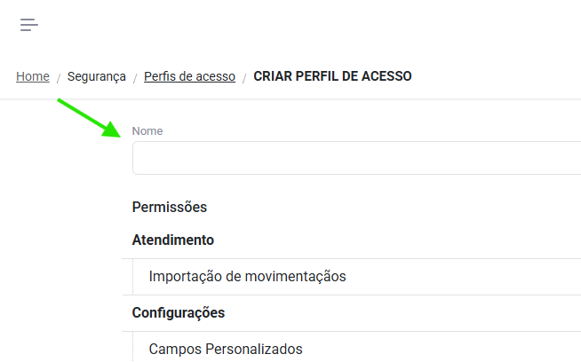{ width="900" }
    </figure>

=== "Passo 3"

    <figure markdown="span">
     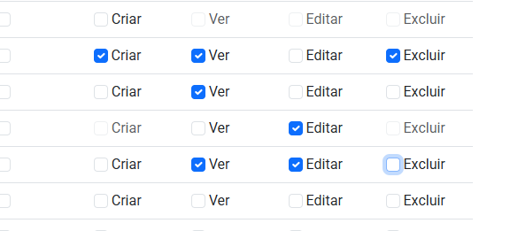{ width="900" }
    </figure>

* Clique em "Salvar" ou "Salvar e voltar" no rodapé da página.

!!! Success "Sucesso"
    Pronto! Você criou um perfil de acesso.

Para mais informações, acesse:
[:octicons-arrow-right-24: Perfis de acesso](access_levels.md) 
{ .card }   

---

## Níveis organizacionais

    Com os perfis de acesso definidos, agora criaremos os níveis organizacionais.
    Os níveis irão garantir quais os dados que cada usuário irá enxergar dentro  
    de cada tela.

Clique no menu `Segurança`, acesse `Níveis organizacionais` e siga os passos:

1. Clique em "Adicionar".

2. Defina um nome para o nível que está criando. (Campo descrição é opcional).

3. No campo "Nível superior", selecione se o nível que está criando pertence a alguma hierarquia.

=== "Passo 1"

    <figure markdown="span">
     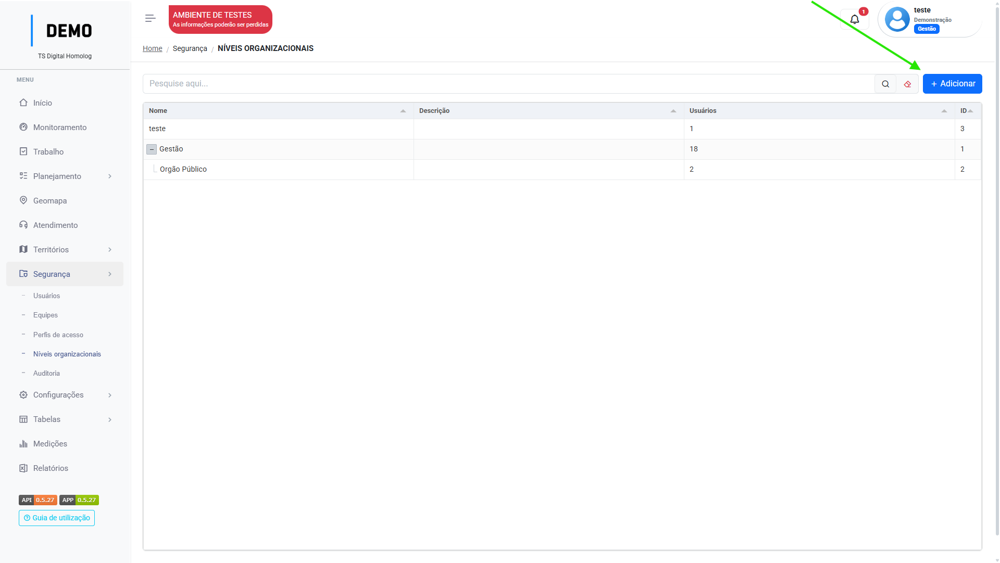{ width="900" }
    </figure>

=== "Passo 2"

    <figure markdown="span">
     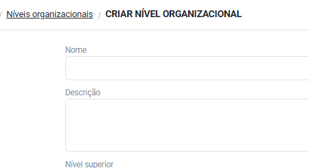{ width="900" }
    </figure>

=== "Passo 3"

    <figure markdown="span">
     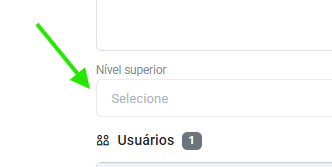{ width="900" }
    </figure>

* Clique em "Salvar" ou "Salvar e voltar".
!!! Success "Sucesso"
    Pronto! Você criou um nível organizacional.

Para mais informações, acesse:
[:octicons-arrow-right-24: Níveis organizacionais](organizational_levels.md) 
{ .card }   

---

## Usuários 

   Agora que já possuímos os perfis e níveis de acesso definidos na plataforma,  
   podemos cadastrar os primeiros usuários. 

Clique no menu `Segurança`, acesse `Usuários` e seguia os passos:

1. Clique em "Adicionar".

2. Você pode criar um usuário vinculado a um CPF e clicar em `continuar`, ou clicar no botão `Criar sem CPF`.

3. Preencha os campos de nome do usuário, e o email de login dele. (Número de telefone opcional)

4. Selecione seu perfil de acesso e nível organizacional.

=== "Passo 1"

    <figure markdown="span">
     { width="900" }
    </figure>

=== "Passo 2"

    <figure markdown="span">
     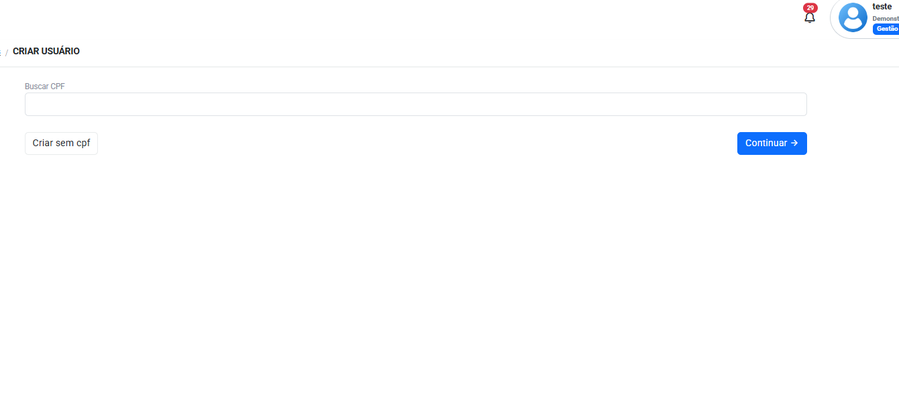{ width="900" }
    </figure>

=== "Passo 3"

    <figure markdown="span">
     { width="900" }
    </figure>

=== "Passo 4"

    <figure markdown="span">
     { width="900" }
    </figure>

* Você pode clicar no switch `gerar senha automaticamente` para desabilitar a opção e  
manualmente inserir uma senha para o usuário. 

* Clique em "Salvar" ou "Salvar e voltar" no rodapé da página.

!!! Success "Sucesso"
    Pronto! Você criou um usuário.

Para mais informações, acesse:
[:octicons-arrow-right-24: Usuários](users.md) 
{ .card }   

---

## Tipos de trabalho

    Para que seja possível o registro de tarefas dos usuários na plataforma,  
    é preciso configurar os tipos de trabalho e seus campos específicos para  
    preenchimento, para isso vamos separar este processo em duas etapas:
    Tipos de trabalho e Campos personalizados.

### Configurando tipos de trabalho

Clique no menu `Configurações`, acesse `Tipo de trabalho` e siga os passos:

1. Clique em "Adicionar".

2. Insira o nome do tipo de trabalho. (Campo descrição opcional).

3. Configure os **campos nativos** do tipo de trabalho:
    Você pode escolher se eles serão exibidos, se são obrigatórios e até renomeá-los!
4. Adicione os **campos personalizados**. 

=== "Passo 1"

    <figure markdown="span">
     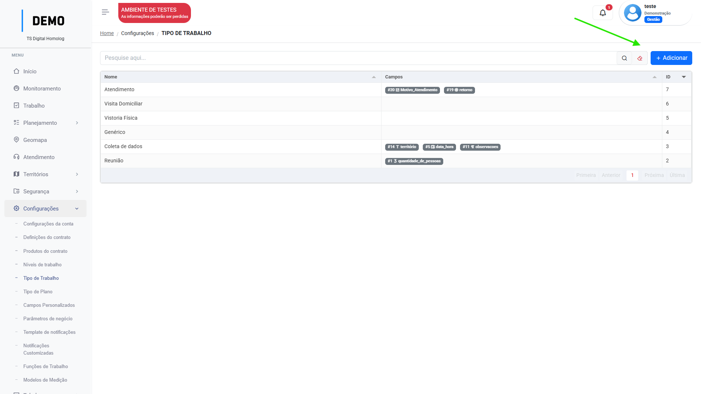{ width="900" }
    </figure>

=== "Passo 2"

    <figure markdown="span">
     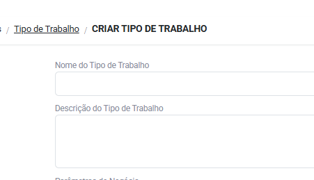{ width="900" }
    </figure>
    

=== "Passo 3"

    <figure markdown="span">
     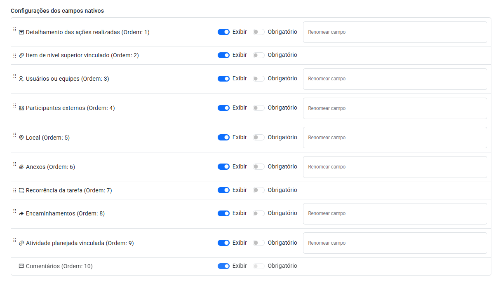{ width="900" }
    </figure>

=== "Passo 4"

    <figure markdown="span">
     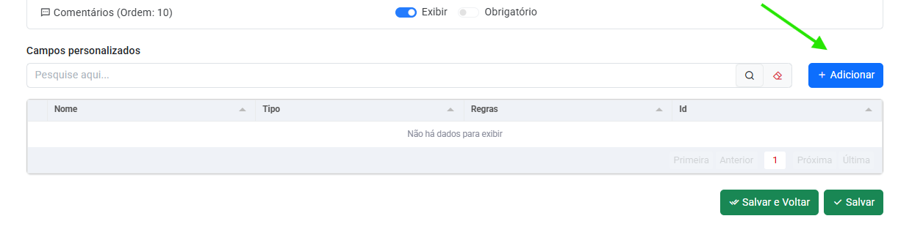{ width="900" }
    </figure>

* Clique em "Salvar" ou "Salvar e voltar".
!!! Success "Sucesso"
    Pronto! Você criou um Tipo de trabalho.

* Veja as informações sobre `parâmetros de negócio`, `produtos` ou `padrões` abaixo:

Para mais informações, acesse:
[:octicons-arrow-right-24: Tipos de trabalho](work_item_types.md) 
{ .card }   

---

### Configurando campos personalizados

Clique no menu `Configurações`, acesse `Campos personalizados` e siga os passos:

1. Clique em "Adicionar".

2. Defina um nome interno para o campo personalizado.
    O campo "Label" será o título do campo visível nas tarefas.

3. Selecione o tipo do campo.

=== "Passo 1"

    <figure markdown="span">
     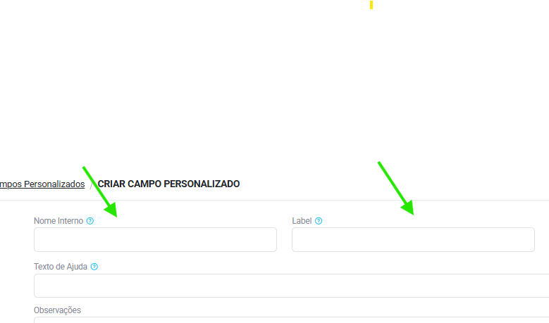{ width="900" }
    </figure>

=== "Passo 2"

    <figure markdown="span">
     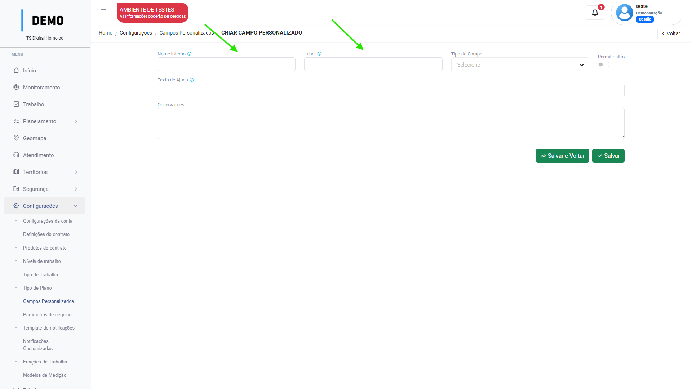{ width="900" }
    </figure>

=== "Passo 3"

    <figure markdown="span">
     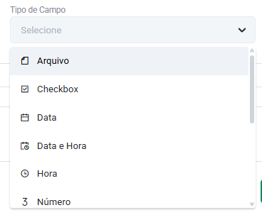{ width="900" }
    </figure>

* Dependendo do tipo de campo selecionado, a plataforma abrirá a configuração daquele campo:

<figure markdown="span">
 { width="900" }
</figure>

* Repare que no exemplo, ao selecionar o tipo "número" o sistema me possibilita especificar o número de casas decimais.

* Clique em "Salvar" ou "Salvar e voltar".
!!! Success "Sucesso"
    Pronto! Você criou um Campo personalizado.

Para mais informações, acesse:
[:octicons-arrow-right-24: Campos personalizados](custom_fields.md) 
{ .card }   

---

## Configurações do contrato

    Esta etapa é a de configuração de medição do contrato, criação do banco  
    de produtos, funções e definição dos parâmetros para medição.

### Criando produtos do contrato

Clique no menu `Configurações`, acessse `Produtos do contrato` e siga os passos:

1. Clique em "Adicionar".

2. Defina um nome para o Produto.(O campo descrição é opcional).

=== "Passo 1"

    <figure markdown="span">
     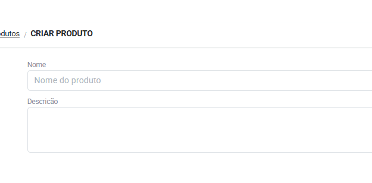{ width="900" }
    </figure>

=== "Passo 2"

    <figure markdown="span">
     { width="900" }
    </figure>
    

* Clique em "Salvar" ou "Salvar e voltar".
!!! Success "Sucesso"
    Pronto! Você criou um produto.

Para mais informações, acesse:
[:octicons-arrow-right-24: Produtos](contract_products.md) 
{ .card }   

---

### Criando funções de trabalho

Clique no menu `Configurações`, acesse `Funções de trabalho` e siga os passos:

1. Clique em "Adicionar".

2. Defina um nome para a função de trabalho.(O campo descrição é opcional).

=== "Passo 1"

    <figure markdown="span">
     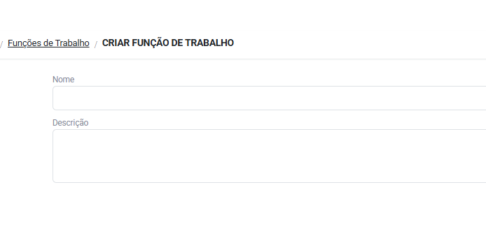{ width="900" }
    </figure>

=== "Passo 2"

    <figure markdown="span">
     { width="900" }
    </figure>

* Clique em "Salvar" ou "Salvar e voltar".
!!! Success "Sucesso"
    Pronto! Você criou uma função de trabalho.

Para mais informações, acesse:
[:octicons-arrow-right-24: Funções de trabalho](job_functions.md) 
{ .card }   

---

### Criando as definições do contrato

Clique no menu `Configurações`, acesse `Definições do contrato` e siga os passos:

1. Clique em "Adicionar".

2. Insira o nome do contrato, defina o status entre Previsto, Ativo ou Encerrado e preencha as datas de início e término do contrato.

3. Selecione o tipo de medição do contrato.

=== "Passo 1"

    <figure markdown="span">
     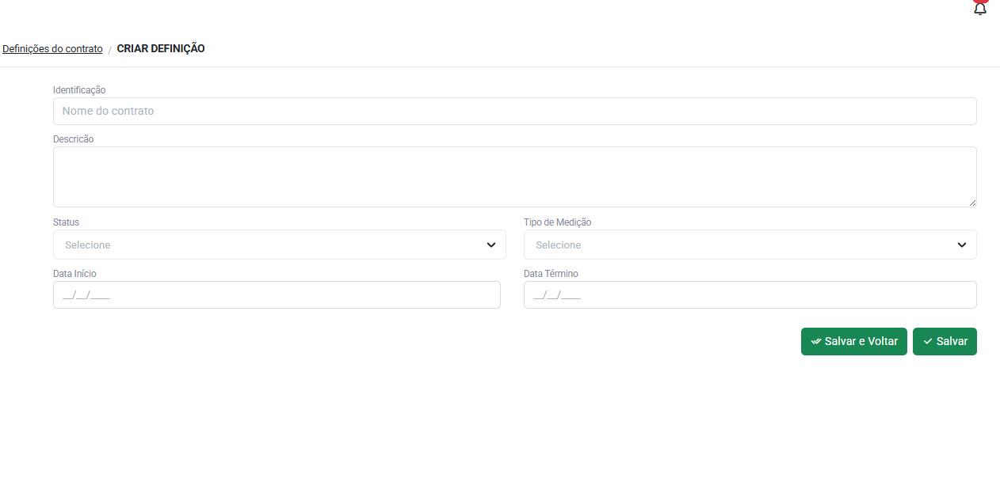{ width="900" }
    </figure>

=== "Passo 2"

    <figure markdown="span">
     { width="900" }
    </figure>

=== "Passo 3"
 
    <figure markdown="span">
     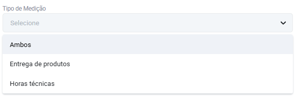{ width="900" }
    </figure>

* Agora, um passo imporante:
     Após selecionar o tipo de medição entre por Produtos, funções ou ambos, a plataforma irá pedir algumas configurações:

<figure markdown="span">
 { width="900" }
</figure>

Para configurar a medição por **produtos**, siga os passos:

1. Clique em "Adicionar produto".

2. Selecione um produto previamente cadastrado em [produtos do contrato](contract_products.md).

3. Selecione a unidade de medição.

4. Indique a quantidade minima e máxima do produto e seu valor unitário.

=== "Passo 1"

    <figure markdown="span">
     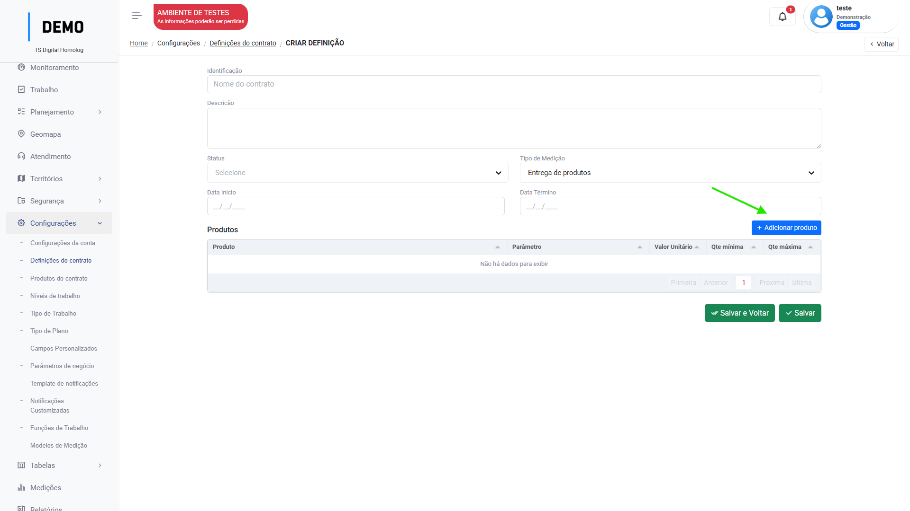{ width="900" }
    </figure>

=== "Passo 2"

    <figure markdown="span">
     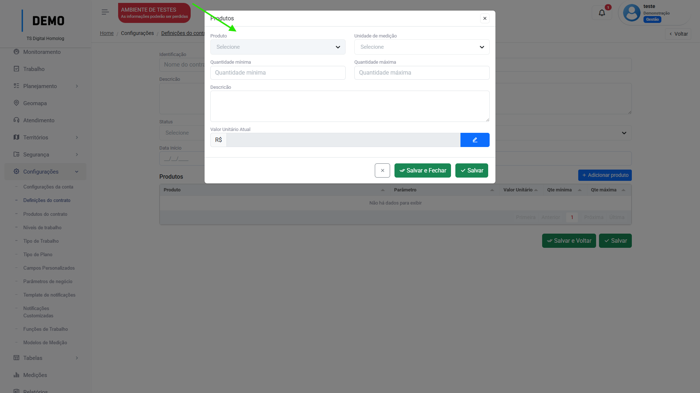{ width="900" }
    </figure>

=== "Passo 3"

    <figure markdown="span">
     { width="900" }
    </figure>

=== "Passo 4"

    <figure markdown="span">
     { width="900" }
    </figure>

 * Clique em "Salvar e fechar"
 * Repita os passos para todos os produtos que pertecem ao contrato.

Para configurar a medição por **Horas técnicas**, siga os passos:

1. Clique em "Adicionar  funções"

2. Selecione uma função de trabalho previamente cadastrada em [funções de trabalho](job_functions.md)

3. Indique a quantidade mínima e máxima de horas no contrato e seu valor/hora. 

=== "Passo 1"

    <figure markdown="span">
     { width="900" }
    </figure>

=== "Passo 2"

    <figure markdown="span">
     { width="900" }
    </figure>

=== "Passo 3"

    <figure markdown="span">
     { width="900" }
    </figure>

* Clique em "Salvar e fechar"
* Repita os passos até cadastrar todas as funções do contrato.

---

* Clique em "Salvar" ou "Salvar e voltar" no rodapé da página
!!! Success "Sucesso"
    Pronto! Você criou uma Definição de contrato.

Para mais informações, acesse:
[:octicons-arrow-right-24: Definições do contrato](contract_definitions.md) 
{ .card }   

---

## Territórios

  No menu Territórios, iremos definir os locais de trabalho em que as tarefas  
  serão registradas pelos usuários no menu Trabalho, divididos entre  
  Áreas territoriais e Empreendimentos.

### Áreas territoriais

No menu `Territórios`, acesse `Áreas territoriais` e siga os passos:

1. Clique em "Adicionar"

2. Insira o nome da Área territorial.

3. Selecione entre Área ou [Regional]("conjunto de áreas") e a abrangência.

4. Para adicionar um nível organizacional a área, desativo o switch "herdar níveis abaixo".
=== "Passo 1"

    <figure markdown="span">
     { width="900" }
    </figure>
    

=== "Passo 2"
    
    <figure markdown="span">
     { width="900" }
    </figure>

=== "Passo 3"

    <figure markdown="span">
     { width="900" }
    </figure>
    

=== "Passo 4"

    <figure markdown="span">
     { width="900" }
    </figure>
   
* Você pode clicar em "Adicionar" para adicionar áreas territoriais abaixo para indicar um conjunto de áreas que fazem parte daquela regional.

* Clique em "Salvar" ou "Salvar e voltar".
!!! Success "Sucesso"
     Pronto! Você criou uma Área territorial.

Para mais informações, acesse:
[:octicons-arrow-right-24: Áreas territoriais](regions.md) 
{ .card }   

---

### Empreendimentos

No menu `Territórios`, acesse `Empreendimentos` e siga os passos:

1. Clique em "Adicionar".

2. Insira o nome do Empreendimento.(Este é o único campo obrigatório, preencha o restante das informações de acordo com os dados do empreendimento que está sendo cadastrado).

3. Insira seu nível organizacional.

=== "Passo 1"

    <figure markdown="span">
     { width="900" }
    </figure>
    

=== "Passo 2"

    <figure markdown="span">
     { width="900" }
    </figure>

=== "Passo 3"

    <figure markdown="span">
     { width="900" }
    </figure>

* Você pode clicar em "Adicionar" para indciar os [condomínios](condominiuns.md) que fazem parte daquele empreendimento.

* Clique em "Salvar" ou "Salvar e voltar".
!!! Success "Sucesso"
    Pronto! Você criou um Empreendimento.

Para mais informações, acesse:
[:octicons-arrow-right-24: Empreendimentos](enterprises.md) 
{ .card }   

---

## Planejamento macro

    Chegou o momento de criar o planejamento de trabalho, onde vamos inserir todo  
    o escopo de itens que compõem o fluxo de trabalho.

Os itens do planejamento são divididos entre os 5 níveis:

Etapa :octicons-arrow-right-24: Macroprocesso :octicons-arrow-right-24: Processo :octicons-arrow-right-24: Atividade :octicons-arrow-right-24: Tarefa

Os níveis funcionam como uma *hierarquia*, sendo a *Etapa* o nível mais alto de planejamento e a *Tarefa* o mais baixo.  

A *Tarefa* é o que os usuários vão usar como registro de trabalho posteriormente no menu `trabalho`.

Ex:

<figure markdown="span">
 { width="900" }
</figure>

### Criando Projetos

Clique no menu `Planejamento`, acesse `Projetos`.

Clique em "Adicionar".

<figure markdown="span">
 { width="900" }
</figure>

Você será direcionado para a aba de `informações` do Projeto. Siga os passos:

<figure markdown="span">
 { width="300" }
</figure>

1. Preencha os campos "Nome", "Contrato", "Data início" e "Data término" do projeto.

2. Clique no switch `modelo`para habilitar o plano como um modelo e selecione seu nível organizacional.

=== "Passo 1"

    <figure markdown="span">
     { width="900" }
    </figure>

=== "Passo 2" 

    <figure markdown="span">
     { width="900" }
    </figure>

* Clique em "Salvar".

Agora, com as informações do `Projeto` salvas, você será redirecionado para a 
aba `Planejador`, onde iremos criar os Itens do plano. Siga os passos:

1. Clique em "Adicionar".

2. Insira o nome do item, selecione o seu nível e clique em "Salvar e fechar".

=== "Passo 1"

    <figure markdown="span">
     { width="900" }
    </figure>
    

=== "Passo 2"

    <figure markdown="span">
     { width="900" }
    </figure>

O item deve ficar desta forma:

<figure markdown="span">
{ width="900" }
</figure>

* Neste exemplo, um item nível **Tarefa** foi criado.
    
* Se um item nível **Atividade** for criado, esta tarefa agora
    pode ser vinculada aquela atividade.(Selecionando a atividade no campo "item superior" na tarefa ou clicando em cima da tarefa e arrastando-a para dentro da atividade) Como no exemplo:

<figure markdown="span">
{ width="900" }
</figure>

* Por serem o nível de registro de trabalho, os itens de nível **tarefa** requerem um tipo de trabalho.
* Se o contrato for medido por **entrega de produtos**, adicione um produto aos itens de nível **atividade**.

* Clique em "Salvar" ou "Salvar e voltar" no rodapé da página.

!!! Success "Sucesso"
    Pronto! Você criou um Projeto.

Para mais informações, acesse:
[:octicons-arrow-right-24: Projetos](project.md) 
{ .card }   

### Criando Ordem de serviço

        Nesta etapa, iremos vincular os planos cadastrados para um território  
        específico onde ele será executado.

No menu `planejamento`, acesse `ordem de serviço` e siga os passos:

1. Clique em "Adicionar".

2. Insira um nome para a Ordem de serviço e selecione o contrato qual ela faz parte.  
   Não esqueça das datas de início e término!

3. Selecione o plano modelo de atividades.

4. Após selecionar o contrato, os campos para inserir **produtos** e/ou **horás técnicas** serão disponibilizados.

=== "Passo 1"

    <figure markdown="span">
     { width="900" }
    </figure>

=== "Passo 2"

    <figure markdown="span">
     { width="900" }
    </figure>

=== "Passo 3"

    <figure markdown="span">
     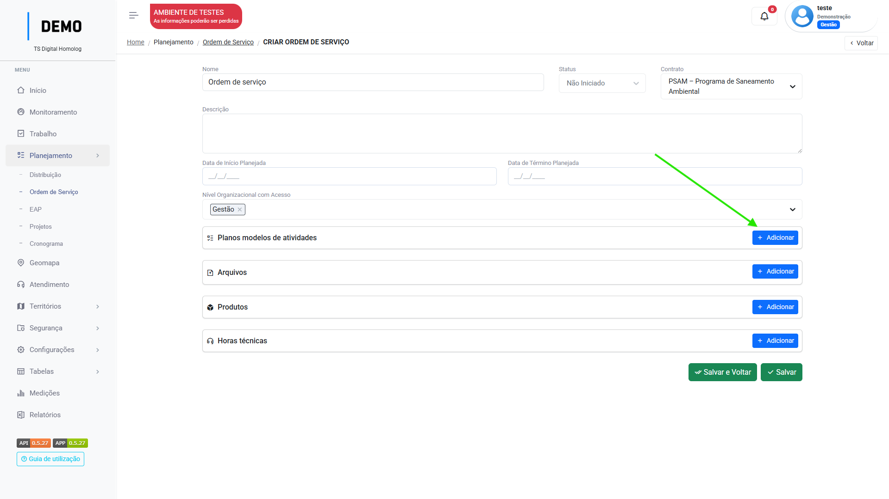{ width="900" }
    </figure>

=== "Passo 4"

    <figure markdown="span">
     { width="900" }
    </figure>

Para medir os produtos clique em "Adicionar" e siga os passos:

1. Selecione o tipo de território entre Área ou Empreendimento e selecione o empreendimento previamente cadastrado.

2. Selecione o produto que será executado na ordem de serviço, a quantidade minima e máxima dele.

=== "Passos 1"

    <figure markdown="span">
     { width="900" }
    </figure>

=== "Passos 2"

    <figure markdown="span">
     { width="900" }
    </figure>

* Clique em "Salvar e fechar".

!!! Success "Sucesso"
    Pronto! Você criou uma ordem de serviço.

!!! Failure " ¯\_(ツ)_/¯" 
    Ainda não desenvolvemos a medição por hora técnica, logo será disponibilziado!

Para mais informações, acesse:
[:octicons-arrow-right-24: Ordem de serviço](service_orders.md) 
{ .card }   

### Criando a Distribuição

        Agora que já temos um mano para ser executado e uma ordem de serviço que  
        indique onde ele será executado, basta criar a distribuíção, onde iremos  
        definir os usuários ou equipes que irão realizar as tarefas.

!!! info
    Em desenvolvimento.

