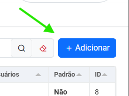
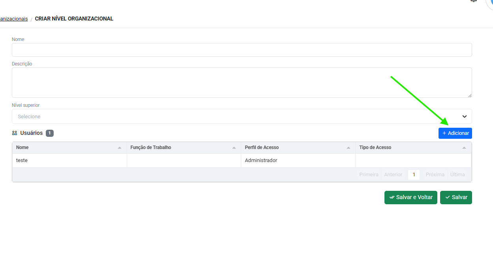

# Configurações iniciais

!!! Info "Informação"
    Nesse passo a passo de configuração, apenas as instruções de implantação do fluxo de trabalho serão passadas, para saber detalhadamente de cada menu, acesse os links abaixo de cada passo.

## Perfis de acesso

    A primeira etapa para configurar o sistema é definir os acessos dos usuários.  
    Os perfis de acesso são utilizados para liberação de telas e as ações dentro  
    delas, como por exemplo, criar, visualizar, excluir e atualizar.

* Clique no menu `Segurança`, acesse `Perfis de acesso` e siga os passos: 

=== "Passo 1"

    <figure markdown="span">
     { width="300" }
    </figure>

    * Clique em "Adicionar".

=== "Passo 2"

    <figure markdown="span">
     { width="300" }
    </figure>

    *  Defina um nome para o perfil que está criando..

=== "Passo 3"

    <figure markdown="span">
     { width="600" }
    </figure>

    * Selecione todas as permissões que este perfil terá em cada tela.
    
    <figure markdown="span">
     { width="300" }
    </figure>

    * Clique em "Salvar" ou "Salvar e voltar".
    !!! Success "Sucesso"
        Pronto! Você criou um perfil de acesso.

Para mais informações, acesse:
[:octicons-arrow-right-24: Perfis de acesso](access_levels.md) 
{ .card }   

---

## Níveis organizacionais

    Com os perfis de acesso definidos, agora criaremos os níveis organizacionais.
    Os níveis irão garantir quais os dados que cada usuário irá enxergar dentro  
    de cada tela.

* Clique no menu `Segurança`, acesse `Níveis organizacionais` e siga os passos:

=== "Passo 1"

    <figure markdown="span">
     { width="300" }
    </figure>

    * Clique em "Adicionar".

=== "Passo 2"

    <figure markdown="span">
     { width="600" }
    </figure>

    * Defina um nome para o nível que está criando.
    * Campo de descrição(opcional)

=== "Passo 3"

    <figure markdown="span">
     { width="300" }
    </figure>

    * No campo "Nível superior", selecione se o nível que está criando  
    pertence a alguma hierarquia.

=== "Passo 4"

    <figure markdown="span">
     { width="600" }
    </figure>

    * Clique em "Adicionar" para selecionar os usuários que pertencem aquele nível.

    <figure markdown="span">
     { width="300" }
    </figure>

    * Clique em "Salvar" ou "Salvar e voltar".
    !!! Success "Sucesso"
        Pronto! Você criou um nível organizacional.

Para mais informações, acesse:
[:octicons-arrow-right-24: Níveis organizacionais](organizational_levels.md) 
{ .card }   

---

## Usuários 

   Agora que já possuímos os perfis e níveis de acesso definidos na plataforma,  
   podemos cadastrar os primeiros usuários. 

* Clique no menu `Segurança`, acesse `Usuários` e seguia os passos:

=== "Passo 1"

    <figure markdown="span">
     { width="300" }
    </figure>

    * Clique em "Adicionar".

=== "Passo 2"

    <figure markdown="span">
     { width="600" }
    </figure>

    * Você pode criar um usuário vinculado a um CPF e clicar em "Continuar".
    * Ou Selecione a opção "Criar sem CPF" que você será direcionado ao  
    cadastro e usuários.

=== "Passo 3"

    <figure markdown="span">
     { width="600" }
    </figure>

    * Insira o nome do usuário
    * Insira o e-mail (será utilizado para o login do usuário)
    * Campo telefone(opcional)

=== "Passo 4"

    <figure markdown="span">
     { width="600" }
    </figure>

    * Selecione o perfil de acesso do usuário e o seu nivel organizacional

        <figure markdown="span">
     { width="300" }
    </figure>

    * Clique em "Salvar" ou "Salvar e voltar".
    !!! Success "Sucesso"
        Pronto! Você criou um usuário.

Para mais informações, acesse:
[:octicons-arrow-right-24: Usuários](users.md) 
{ .card }   

---

## Tipos de trabalho

    Para que seja possível o registro de tarefas dos usuários na plataforma,  
    é preciso configurar os tipos de trabalho e seus campos específicos para  
    preenchimento, para isso vamos separar este processo em duas etapas:
    Tipos de trabalho e Campos personalizados.

### Configurando tipos de trabalho

* Clique no menu `Configurações`, acesse `Tipo de trabalho` e siga os passos:

=== "Passo 1"

    <figure markdown="span">
     { width="300" }
    </figure>

    * Clique em "Adicionar".

=== "Passo 2"

    <figure markdown="span">
     { width="300" }
    </figure>
    
    * Preencha o nome do tipo de trabalho.
    * Campo descrição(opcional)

=== "Passo 3"

    <figure markdown="span">
     { width="600" }
    </figure>

    * Configure os **campos nativos** do tipo de trabalho.
    * Você pode escolher se eles serão exibidos ou não, 
    se são obrigatórios e inclusive renomeá-los. 

=== "Passo 4"

    <figure markdown="span">
     { width="600" }
    </figure>

    * Adicione os campos personalizados do tipo de trabalho.

    <figure markdown="span">
     { width="300" }
    </figure>

    * Clique em "Salvar" ou "Salvar e voltar".
    !!! Success "Sucesso"
        Pronto! Você criou um Tipo de trabalho.

Para mais informações, acesse:
[:octicons-arrow-right-24: Tipos de trabalho](work_item_types.md) 
{ .card }   

---

### Configurando campos personalizados

* Clique no menu `Configurações`, acesse `Campos personalizados` e siga os passos:

=== "Passo 1"

    <figure markdown="span">
     { width="300" }
    </figure>

    * Clique em "Adicionar".

=== "Passo 2"

    <figure markdown="span">
     { width="600" }
    </figure>

    * Defina um nome interno para o campo personalizado.
    * O campo "Label" será o título do campo visível nas tarefas.

=== "Passo 3"

    <figure markdown="span">
     { width="300" }
    </figure>

    * Selecione qual o tipo do campo.
    * Dependendo do tipo do campo, o sistema trará informações adicionais  
    para preenchimento.

    <figure markdown="span">
     { width="300" }
    </figure>

    * Clique em "Salvar" ou "Salvar e voltar".
    !!! Success "Sucesso"
        Pronto! Você criou um Campo personalizado.

!!! Warning "Lembrete"
    Não se esqueça de adicionar estes campos personalizados aos tipos de trabalho.

Para mais informações, acesse:
[:octicons-arrow-right-24: Campos personalizados](custom_fields.md) 
{ .card }   

---

## Configurações do contrato

    Esta etapa é a de configuração de medição do contrato, criação do banco  
    de produtos, funções e definição dos parâmetros para medição.

### Criando produtos do contrato

* Clique no menu `Configurações`, acessse `Produtos do contrato` e siga os passos:

=== "Passo 1"

    <figure markdown="span">
     { width="300" }
    </figure>

    * Clique em "Adicionar".

=== "Passo 2"

    <figure markdown="span">
     { width="600" }
    </figure>

    * Defina um nome para o produto
    * Campo descrição(opcional).
    
    <figure markdown="span">
     { width="300" }
    </figure>

    * Clique em "Salvar" ou "Salvar e voltar".
    !!! Success "Sucesso"
        Pronto! Você criou um produto.

Para mais informações, acesse:
[:octicons-arrow-right-24: Produtos](contract_products.md) 
{ .card }   

---

### Criando funções de trabalho

* Clique no menu `Configurações`, acesse `Funções de trabalho` e siga os passos:

=== "Passo 1"

    <figure markdown="span">
     { width="300" }
    </figure>

    * Clique em "Adicionar".

=== "Passo 2"

    <figure markdown="span">
     { width="600" }
    </figure>

    * Defina um nome para a função de trabalho.
    * Campo descrição(opcional).
    
    <figure markdown="span">
     { width="300" }
    </figure>

    * Clique em "Salvar" ou "Salvar e voltar".
    !!! Success "Sucesso"
        Pronto! Você criou uma função de trabalho.

Para mais informações, acesse:
[:octicons-arrow-right-24: Funções de trabalho](job_functions.md) 
{ .card }   

---

### Criando as definições do contrato

* Clique no menu `Configurações`, acesse `Definições do contrato` e siga os passos:

=== "Passo 1"

    <figure markdown="span">
     { width="300" }
    </figure>

    * Clique em "Adicionar".

=== "Passo 2"

    <figure markdown="span">
     { width="600" }
    </figure>

    * Defina o nome do contrato.
    * Campo descrição(opcional).
    * Selecione o status do contrato entre Previsto, Ativo ou Encerrado.
    * Preencha as datas de início e término do contrato.

=== "Passo 3"
 
    <figure markdown="span">
     { width="600" }
    </figure>

    * Selecione o "Tipo de medição" entre por Produto, Função ou ambos.

=== "Passo 4"

    <figure markdown="span">
     { width="600" }
    </figure>

    * Clique em "Adicionar" e adicione os produtos ou funções definidos nos passos anteriores 
    em produtos do contrato e funções de trabalho de acordo com o tipo de medição selecionado.

    <figure markdown="span">
     { width="300" }
    </figure>

    * Clique em "Salvar" ou "Salvar e voltar".
    !!! Success "Sucesso"
        Pronto! Você criou uma Definição de contrato.

Para mais informações, acesse:
[:octicons-arrow-right-24: Definições do contrato](contract_definitions.md) 
{ .card }   

---

## Territórios

  No menu Territórios, iremos definir os locais de trabalho em que as tarefas  
  serão registradas pelos usuários no menu Trabalho, divididos entre  
  Áreas territoriais e Empreendimentos.

### Áreas territoriais

* No menu `Territórios`, acesse `Áreas territoriais` e siga os passos:

=== "Passo 1"

    <figure markdown="span">
     { width="300" }
    </figure>
    
    * Clique em "Adicionar"

=== "Passo 2"
    
    <figure markdown="span">
     { width="900" }
    </figure>
    
    * Insira o nome da Área territorial

=== "Passo 3"

    <figure markdown="span">
     { width="900" }
    </figure>
    
    * Selecione o Tipo de área entre Área ou [Regional]("conjunto de áreas").
    * Selecione a abrangência entre Estado, município ou regiões.

=== "Passo 4"

    <figure markdown="span">
     { width="900" }
    </figure>
   
    * Selecione um nível organizacional.

    <figure markdown="span">
     { width="300" }
    </figure>

    * Clique em "Salvar" ou "Salvar e voltar".
    !!! Success "Sucesso"
        Pronto! Você criou uma Área territorial.

Para mais informações, acesse:
[:octicons-arrow-right-24: Áreas territoriais](regions.md) 
{ .card }   

---

### Empreendimentos

* No menu `Territórios`, acesse `Empreendimentos` e siga os passos:

=== "Passo 1"

    <figure markdown="span">
     { width="300" }
    </figure>
    
    * Clique em "Adicionar"

=== "Passo 2"

    <figure markdown="span">
     { width="900" }
    </figure>

    * Insira o nome do Empreendimento. 
    * Neste menu, apenas o nome é obrigatório.

=== "Passo 3"

    <figure markdown="span">
     { width="900" }
    </figure>

    * Preencha os demais campos de acordo com as informações  
    do empreendimento que está cadastrando e insira seu **nível organizacional**.

    <figure markdown="span">
     { width="300" }
    </figure>

    * Clique em "Salvar" ou "Salvar e voltar".
    !!! Success "Sucesso"
        Pronto! Você criou um Empreendimento.

Para mais informações, acesse:
[:octicons-arrow-right-24: Empreendimentos](enterprises.md) 
{ .card }   

---

## Planejamento macro

    Chegou o momento de criar o planejamento de trabalho, onde vamos inserir todo  
    o escopo de itens que compõem o fluxo de trabalho.

### Criando Projetos

* Clique no menu `Planejamento`, acesse `Projetos` e siga o passo a passo:

=== "Passo 1"

    <figure markdown="span">
     { width="300" }
    </figure>
    
    * Clique em "Adicionar"

=== "Passo 2"
    
    Você será direcionado para a aba de `informações` do projeto.

    <figure markdown="span">
     { width="900" }
    </figure>

    * Preencha os campos de Nome, contrato, data início e data término do projeto.

=== "Passo 3" 

    <figure markdown="span">
     { width="900" }
    </figure>

    * Clique na opção "modelo" para habiltiar o plano como um modelo.
    * Selecione o nível organizacional.
    * Clique em "Salvar".

Agora, com as informações do `Projeto` salvas, você será redirecionado para  
aba `Planejador`, onde iremos criar os Itens do plano. Sendo que os itens de  
nível "Tarefa" serão os que aparecerão no menu trabalho para preenchimento  
dos usuários.
 Siga os passos:

=== "Passo 1"

    Na aba `planejador`:

    <figure markdown="span">
     { width="900" }
    </figure>
    
    * Clique em "Adicionar"

=== "Passo 2"

    <figure markdown="span">
     { width="900" }
    </figure>

    * Insira o nome do item.
    * Selecione seu **nível** entre Etapa, Macroprocesso, Processo, Ativdade e Tarefa.
    * Clique em "Salvar e fechar"

=== "Passo 3"

    O item deve ficar desta forma:

    <figure markdown="span">
     { width="900" }
    </figure>

    * Neste exemplo, um item nível **Tarefa** foi criado.
    
    * Se um item nível **Atividade** for criado, esta tarefa agora
    pode ser vinculada aquela atividade. Como no exemplo:

    <figure markdown="span">
     { width="900" }
    </figure>

=== "Passo 4"

    Monte o planejamento da forma que se encaixe melhor no seu fluxo de trabalho.

    <figure markdown="span">
     { width="300" }
    </figure>

    * Clique em "Salvar" ou "Salvar e voltar".
    !!! Success "Sucesso"
        Pronto! Você criou um Projeto.

!!! Warning "Atenção"
    Se o contrato tem como base de medição "Entrega de produtos", deve-se  
    adicionar um produto quando o nível do item for "Atividade"  
    Os itens de nível "Tarefa" são obrigatórios selecionar um "Tipo de trabalho".

### Criando Ordem de serviço

### Criando a Distribuição

