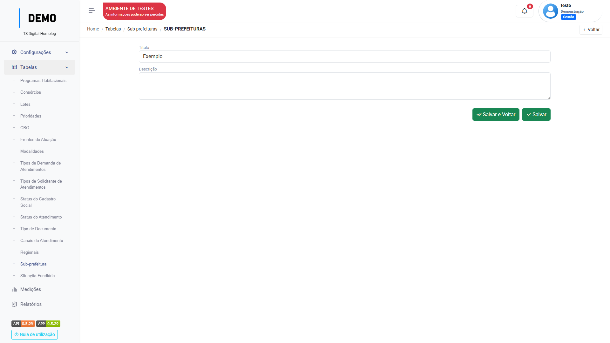

# Tabelas

O menu `Tabelas` é um banco de informações da própria plataforma, onde o usuário deve inserir os valores que irão aparecer nos respectivos campos: 

``` markdown

Programas habitacionais
Consórcios
Lotes
Prioridades
CBO
Frentes de Atuação
Modalidades
Tipos de Demanda de atendimentos
Tipos de Socilitante de atendimentos
Tipo de documento
canais de atendimento
Regionais
Sub-prefeitura
Situação Fundiária

```

Por exemplo, no menu `Territórios`→`Àreas territoriais`, ao cadastrar uma área, um campo de seleção "Sub-Prefeitura" está disponível para preenchimento. Porém só irão aparecer os valores no campo que forem adicionados previamente ao menu `Tabelas` → `Sub-Prefeitura`: 

_Cadastro da informação no menu `Tabelas`:_
<figure markdown="span">
{ width="900" }
</figure>

_Valor no campo de seleção do menu `Áreas territoriais`_:
<figure markdown="span">
{ width="900" }
</figure>

---


