# Tipo de trabalho 

## Como criar um tipo de trabalho

Clique no menu `Configurações`, acesse `Tipo de trabalho` e siga os passos:

1. Clique em "Adicionar".

2. Insira o nome do tipo de trabalho. (Campo descrição opcional).

3. Configure os **campos nativos** do tipo de trabalho:
    Você pode escolher se eles serão exibidos, se são obrigatórios e até renomeá-los!
4. Adicione os **campos personalizados**. 

=== "Passo 1"

    <figure markdown="span">
     { width="900" }
    </figure>

=== "Passo 2"

    <figure markdown="span">
     { width="900" }
    </figure>
    

=== "Passo 3"

    <figure markdown="span">
     { width="900" }
    </figure>

=== "Passo 4"

    <figure markdown="span">
     { width="900" }
    </figure>

* Clique em "Salvar" ou "Salvar e voltar".

---

## Campos nativos

Cada campo nativo tem sua função dentro das tarefas:

### Detalhamento das ações realizadas

Este é um campo de texto que tem como finalidade o registro detalhado do que foi realizado naquela tarefa. O texto é formatável, ou seja, suporta algumas edições como títulos, parágrafos, texto em negrito.
 

### Item de nível superior vinculado

Este campo possibilita o usuário a vincular uma tarefa [não planejada]("que não possui vinculo com planos") a um `Projeto` ou `EAP`.

??? question "**Como fazer os vínculos?**"

    1. Clique em adicionar

    2. Selecione o plano que deseja realizar o vínculo

    3. Selecione a atividade em que a tarefa será vinculada e clique em "confirmar".

    === "Passo 1"

        <figure markdown="span">
        { width="900" }
        </figure>

    === "Passo 2"

        <figure markdown="span">
        { width="900" }
        </figure>

    === "Passo 3"

        <figure markdown="span">
        { width="900" }
        </figure>

### Usuários ou Equipes

Campo de atribuição de usuários e equipes na tarefa.

??? question "**Como adicionar usuários?**"

    1. Clique em adicionar

    2. Selecione o usuário ou equipe que deseja adicionar a tarefa.

    3. Selecione a função daquele usuário ou equipe dentro daquela tarefa.

    === "Passo 1"

        <figure markdown="span">
        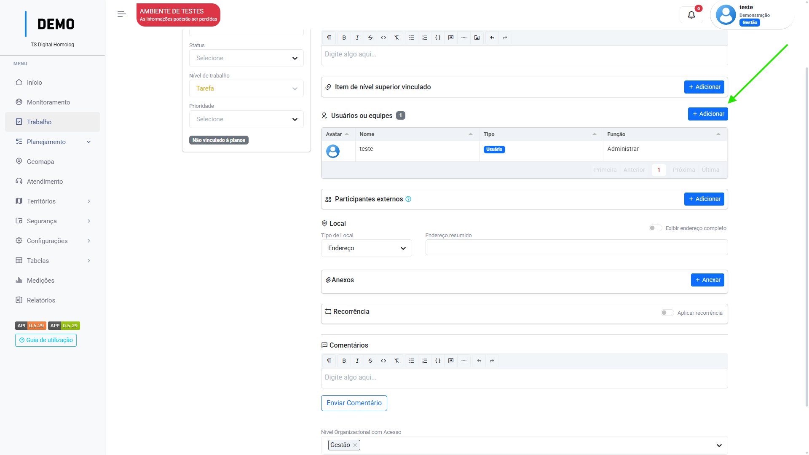{ width="900" }
        </figure>

    === "Passo 2"

        <figure markdown="span">
        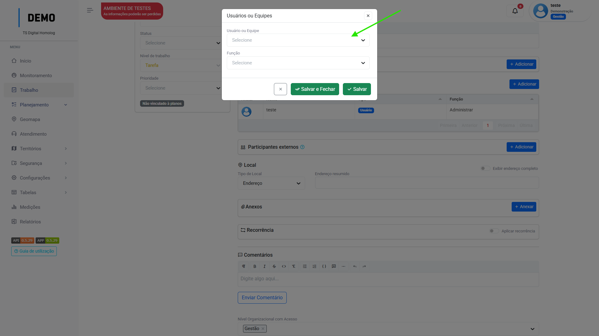{ width="900" }
        </figure>

    === "Passo 3"

        <figure markdown="span">
        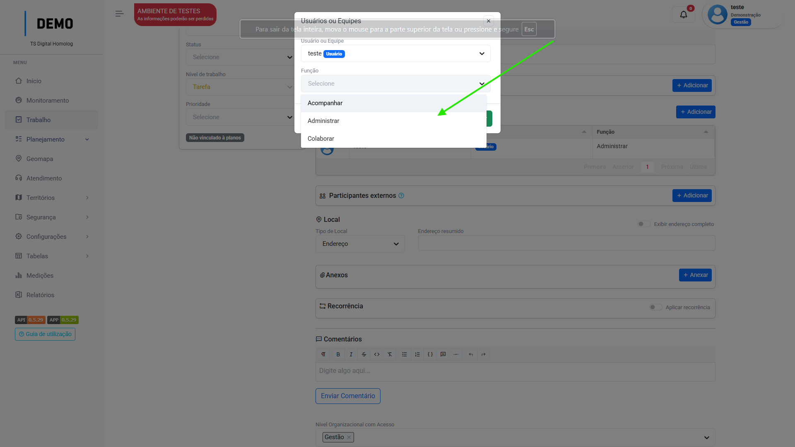{ width="900" }
        </figure>

    Clique em "Salvar".

### Participantes externos

Este campo tem como finalidade a adição dos participantes daquela tarefa que não necessariamente são usuários da plataforma, são extraídos do menu [`Pessoas`](people.md) e [`Famílias`](families.md).

??? question "**Como adicionar participantes externos?**"
    
    1. Clique em adicionar

    2. Selecione a pessoa que deseja adicionar a tarefa.

    3. Ou selecione "Famílias" e selecione a família que deseja adicionar a tarefa.

    === "Passo 1"

        <figure markdown="span">
        { width="900" }
        </figure>

    === "Passo 2"

        <figure markdown="span">
        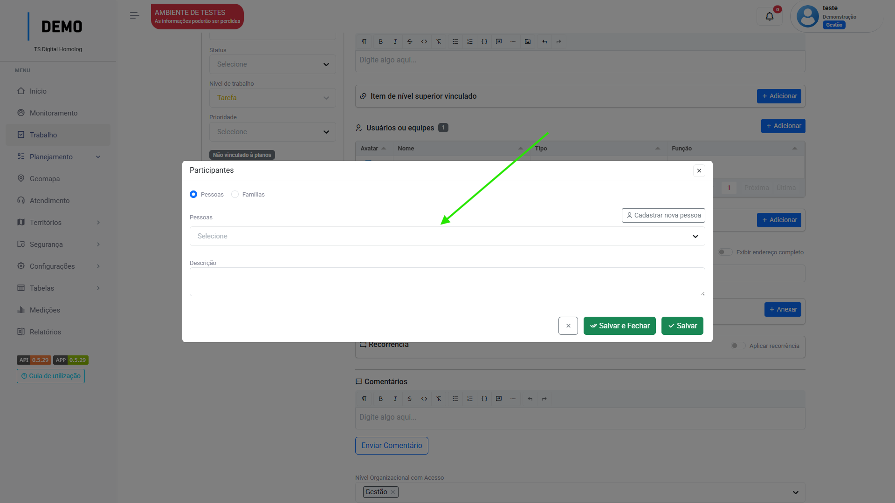{ width="900" }
        </figure>

    === "Passo 3"

        <figure markdown="span">
        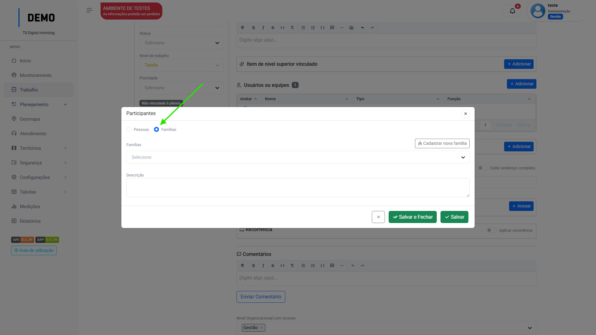{ width="900" }
        </figure>

    Clique em "Salvar".

### Local

Campo de seleção do `Território` em que a tarefa está sendo realizada.

??? question "**Como selecionar o território?**"

    Este campo pode variar dependendo do `tipo de território` escolhido.  
    Se ele for um `Empreendimento` ou `Área territorial`, basta realizar a seleção. 
    Porém, é possível selecionar o tipo como "Endereço" ou "Lote fiscal", o que obrigará o usuário a preencher o campo com caracteres. 

    
    1. Selecione o tipo de local.

    2. Selecione o Território para Área Territorial ou Empreendimento.

    3. Ou selecione "Endereço" e "Lote fiscal" para preencher manualmente.

    === "Passo 1"

        <figure markdown="span">
        { width="900" }
        </figure>

    === "Passo 2"

        <figure markdown="span">
        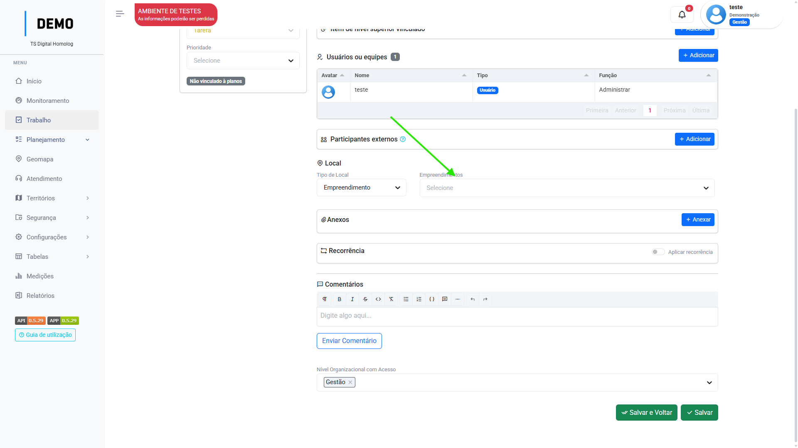{ width="900" }
        </figure>

    === "Passo 3"

        <figure markdown="span">
        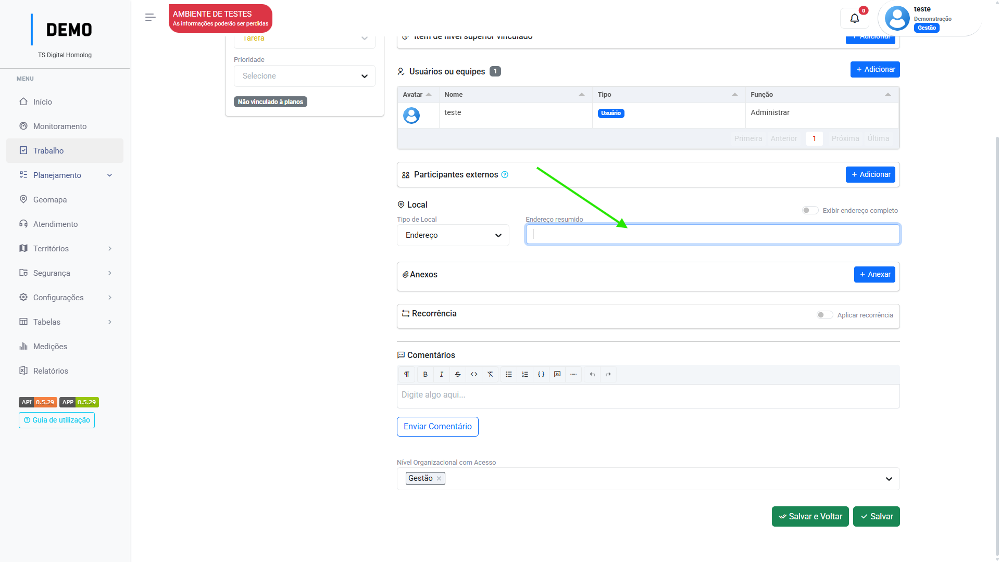{ width="900" }
        </figure>

    Quando selecionar "Endereço", pode-se detalhar o endereço clicando no switch "Exibir endereço completo".

    

### Anexos

Campo de adição de anexos a tarefa. 

??? question "**Como anexar arquivos?**"
    
    1. Clique em "Anexar".

    2. Selecione o arquivo de seu computador.

    3. Dê um nome ao anexo e selecione o "Tipo de conteúdo".

    4. Ative o switch "usar como evidência" para que o anexo possa ser estraído em futuros relatórios. _A plataforma irá orientar o usuário de como o anexo deve ser inserido caso seja usado como evidência, como no exemplo._

    === "Passo 1"

        <figure markdown="span">
        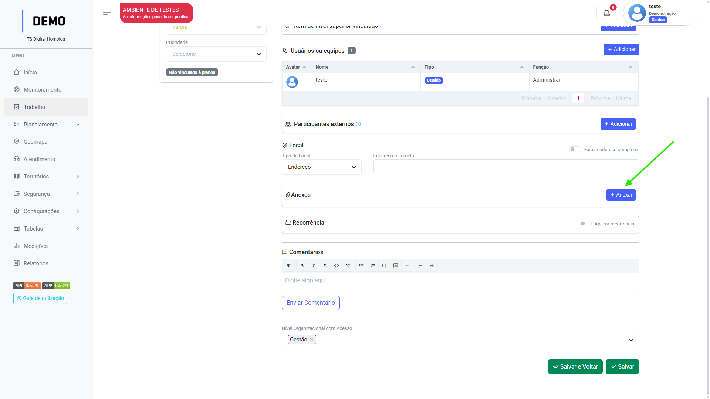{ width="900" }
        </figure>

    === "Passo 2"

        <figure markdown="span">
        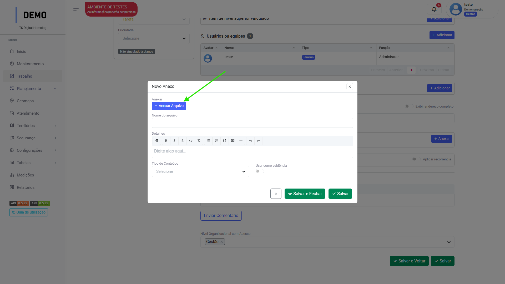{ width="900" }
        </figure>

    === "Passo 3"

        <figure markdown="span">
        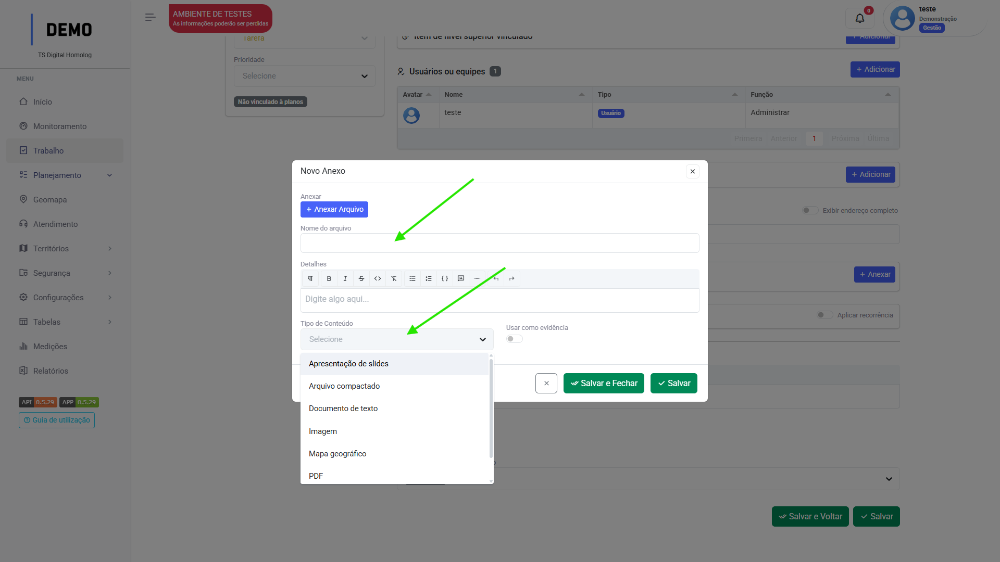{ width="900" }
        </figure>
    
    === "Passo 4"

        <figure markdown="span">
        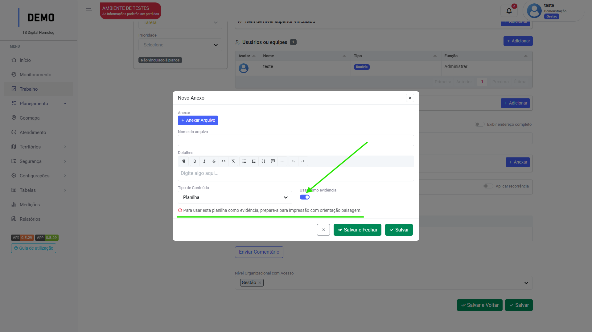{ width="900" }
        </figure>

### Recorrência da tarefa

Campo de seleção de recorrência da tarefa.  

Quando uma tarefa pode se repetir diversas vezes, o usuário pode programar neste campo para que esta tarefa esteja sempre presente em sua lista de trabalho, desta forma, toda vez que ele aplicar o status `Concluído`, uma nova tarefa com os dados copiados dessa tarefa será criada no menu `Trabalho`, de acordo com a recorrência aplicada.

??? question "**Como aplicar a recorrência?**"
    
    1. Clique no switch de "aplicar recorrência".

    2. Selecione a periodicidade da recorrência, por exemplo "a cada 2 dias".

    3. Se a periodicidade for por semana, você poderá escolher o dia em que ela ocorre, selecione quando ela acaba.

    === "Passo 1"

        <figure markdown="span">
        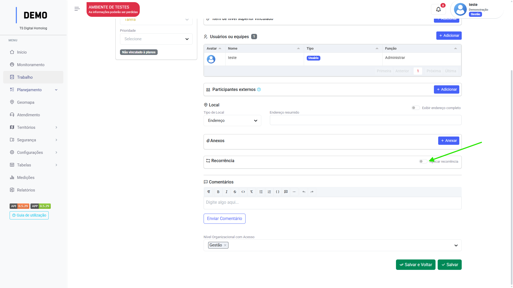{ width="900" }
        </figure>

    === "Passo 2"

        <figure markdown="span">
        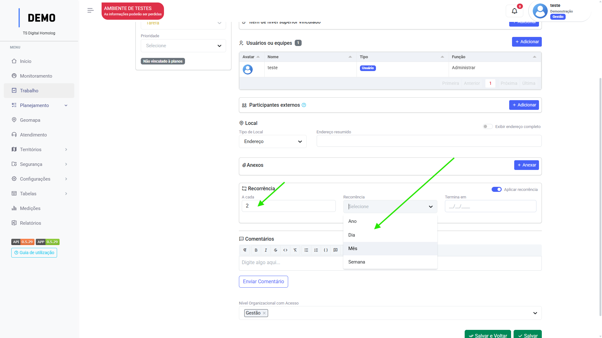{ width="900" }
        </figure>

    === "Passo 3"

        <figure markdown="span">
        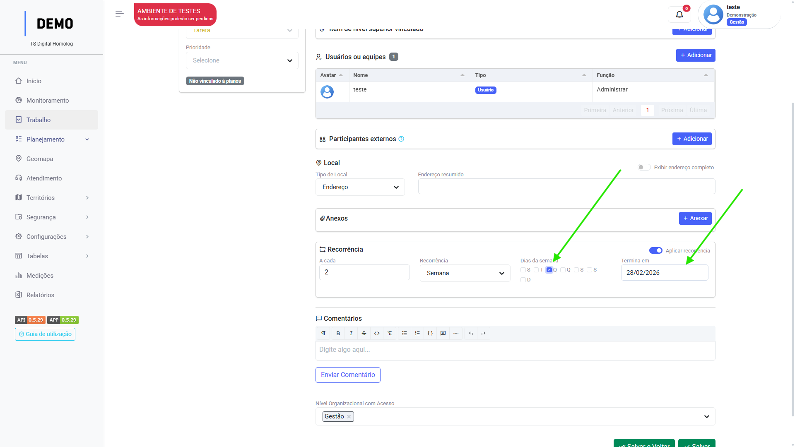{ width="900" }
        </figure>

### Encaminhamentos

Algumas tarefas podem gerar outras tarefas como "encaminhamento", este campo está disponível para indicar esses casos.

* Cria outra tarefa.

??? question "**Como criar encaminhamentos**?" 

    1. Clique em "Adicionar".

    2. Preencha os dados da tarefa que está será criada como encaminhamento.

    === "Passo 1"

        <figure markdown="span">
        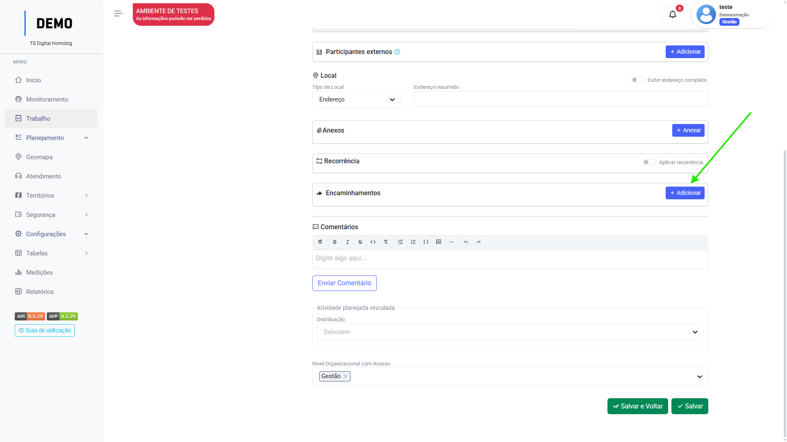{ width="900" }
        </figure>

    === "Passo 2"

        <figure markdown="span">
        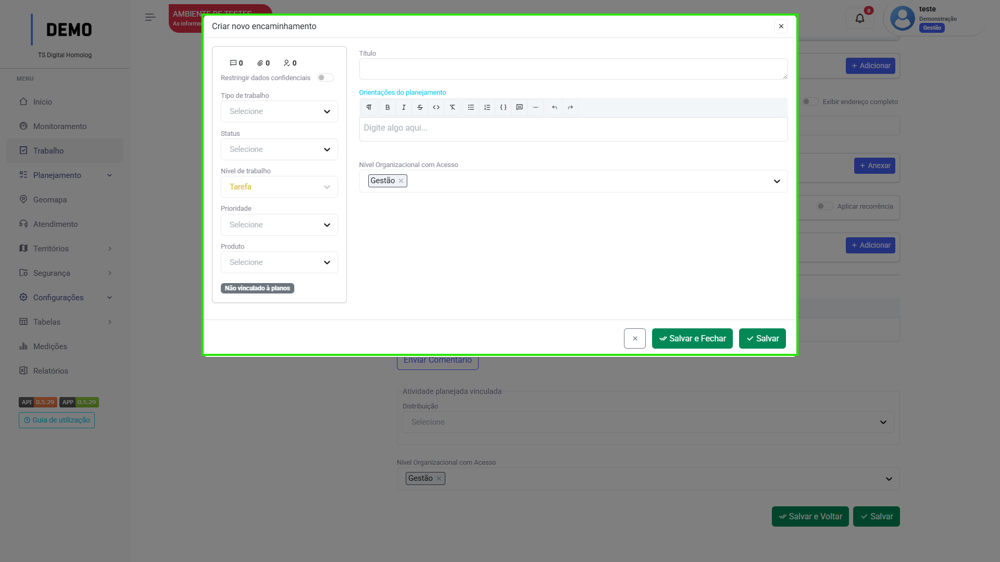{ width="900" }
        </figure>

### Atividade planejada ou vinculada

Campo de vínculo com a `Distribuição`.

Semelhante ao campo de "Item superior vinculado", faz o vínculo com a distribuição. Porém, neste tipo de trabalho é preciso que possua um produto vinculado a ele, pois o campo só irá disponibilizar as atividades para vínculo que possuam o mesmo produto que o tipo de trabalho.

??? question "**Como selecionar atividade planejada**?" 

    1. Selecione a `Distribuição`.

    2. Selecione a atividade.

    === "Passo 1"

        <figure markdown="span">
        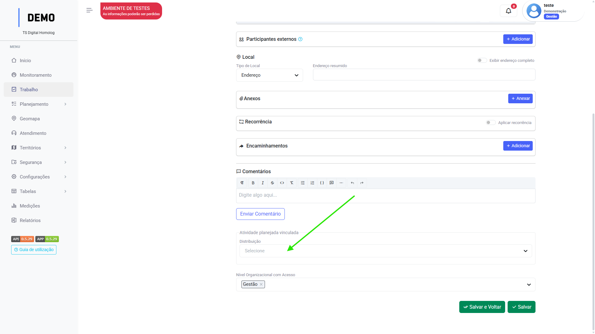{ width="900" }
        </figure>

    === "Passo 2"

        <figure markdown="span">
        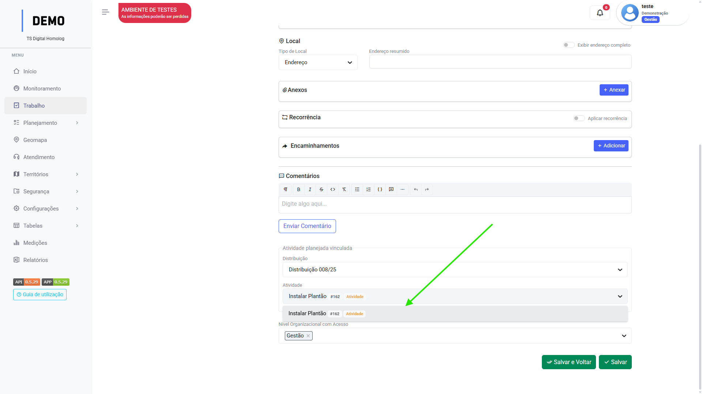{ width="900" }
        </figure>

### Comentários

Campo para que os usuários possam trocar comentários nas tarefas.

??? question "**Como fazer um comentário?**"

    Preencha o campo com o comentário e clique em "enviar comentário".
    
    <figure markdown="span">
    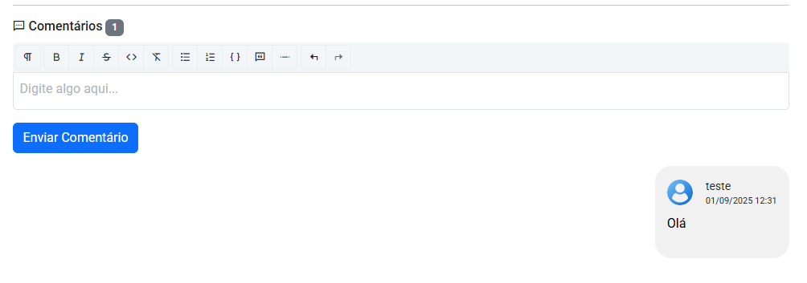{ width="600" }
    </figure>

---

## Campos personalizados

Ao contrário dos campos nativos que possuem parâmetros dentro da plataforma, os `campos personalizados` são parametrizados pelo próprio usuário. Quando desejar que aquele campo apareça em um tipo de trabalho, basta adicioná-lo:

1. Na sessão de Campos personalizados, clique em "Adicionar".

    <figure markdown="span">
    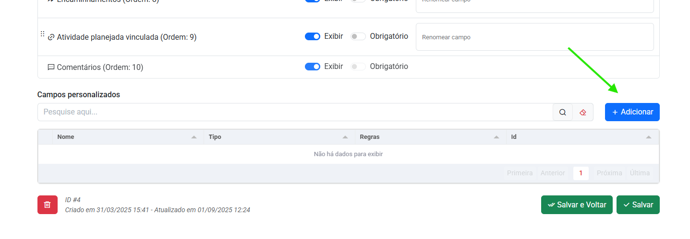{ width="900" }
    </figure>

2. Selecione o campo desejado.

    <figure markdown="span">
    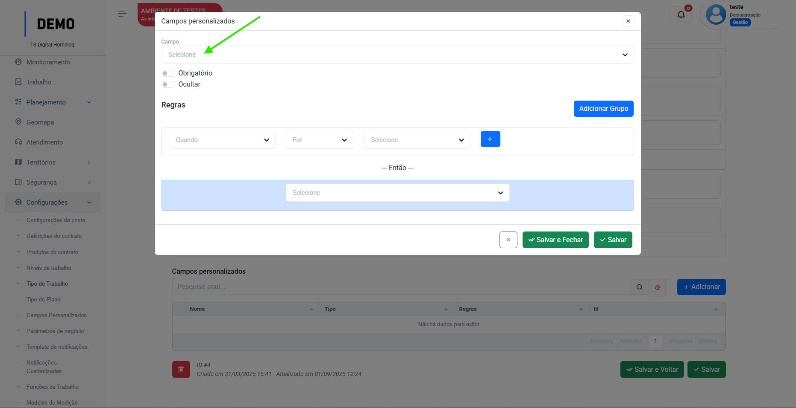{ width="900" }
    </figure>

3. Você pode ativar o switch para torná-lo um campo de preenchimento **obrigatório**, ou ocultá-lo.

    <figure markdown="span">
    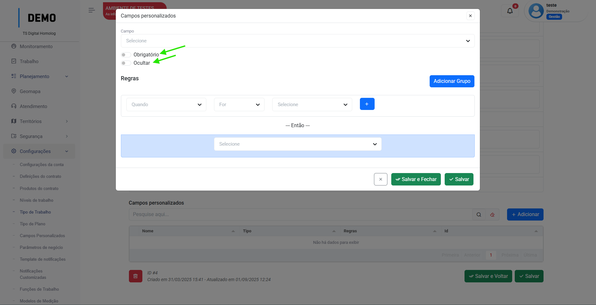{ width="900" }
    </figure>

4. Você pode criar regras para aquele campo, como no exemplo:

    <figure markdown="span">
    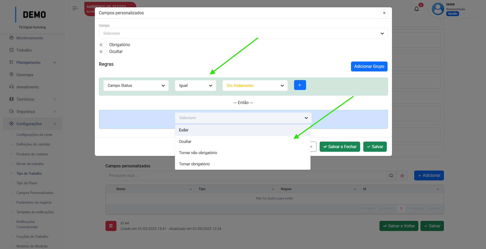{ width="900" }
    </figure>
_Neste exemplo, a regra está configurada para que o campo apareça quando a tarefa estiver com status **em andamento**_

5. Adicione opções exclusivas para escolha naquele tipo de trabalho(opcional)

    <figure markdown="span">
    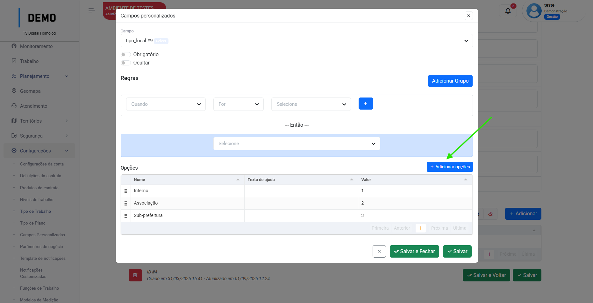{ width="900" }
    </figure>

Clique em "Salvar".

Repita os passos até incluir todos os campos necessários.

---

## Parâmetros de negócio 

Você pode adicionar [`Parâmetros de negócio`](business_params.md) ao seu tipo de trabalho no campo:

<figure markdown="span">
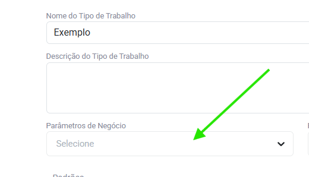{ width="600" }
</figure>

## Produtos

Você pode adicionar [`Produtos `](contract_products.md) ao seu tipo de trabalho no campo:

<figure markdown="span">
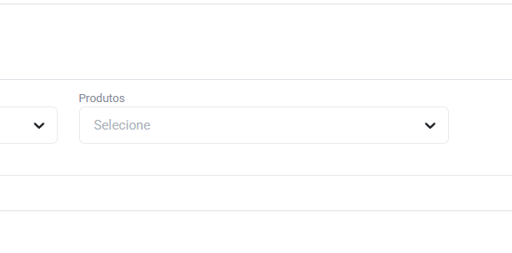{ width="600" }
</figure>

_Para finalidade de medição e relatórios_

## Padrões

Há uma sessão de configuração dos padrões daquele tipo de trabalho, afim de facilitar o processo de preenchimento das tarefas com aquele tipo de trabalho, por exemplo, definir o título daquela tarefa, status, prioridades e restrição de dados.  

<figure markdown="span">
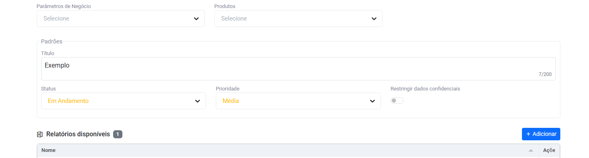{ width="600" }
</figure>

Ou seja, o que for definido nos padrões será replicado toda vez que aquele tipo de trabalho for selecionado em uma tarefa. Se o usuário definir que um título no padrão, este será o título da tarefa.

<figure markdown="span">
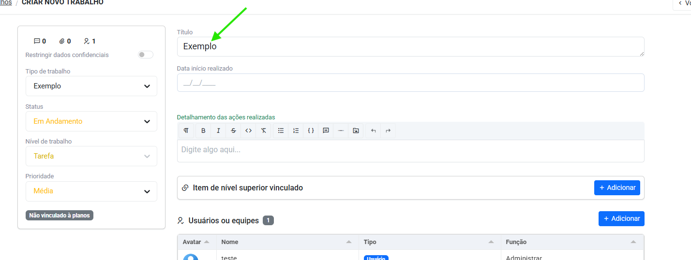{ width="600" }
</figure>

---