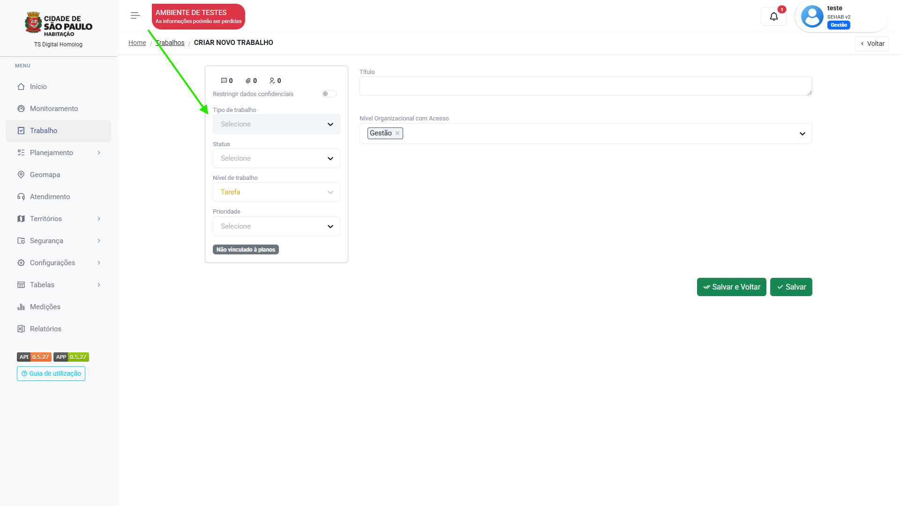

# Trabalho

O menu `trabalho` é onde o usuário poderá visualizar os itens de trabalhos atribuídos e criados por ele.

## Visualização 

No canto superior direito da tela do menu trabalho, é possível localizar o um botão de seleção de visualização, 
em `lista`, `kanban` ou `calendário`:

=== "Lista"

    <figure markdown="span">
     { width="900" }
    </figure>
     
     * Exibe os itens listados.
     * Utilize o botão `classificar` para selecionar a ordem de classificação da lista desejada.

=== "Kanban"

    <figure markdown="span">
     { width="900" }
    </figure>

    * Exibe os itens como "cartões" separados em colunas por status.
    * Clique e arraste os cartões para alterar seu progresso.

=== "Calendário"

    <figure markdown="span">
     { width="900" }
    </figure>

    * Itens exibidos em formato de calendário.
    * Filtre a exibição por itens [`realizados`]("com status concluído"), [`programados`]("com status programado") ou [`planejados`]("gerados por distribuição"). 

## Filtros

O botão `filtrar` está disponível para que o usuário filtre suas tarefas da forma mais adequada para seu uso:

<figure markdown="span">
 { width="600" }
</figure>

Basta selecionar os valores de acordo:

[`Quando`]("valor a ser filtrado"), [`for`]("operador lógico"), e selecionar os valores existentes.

Por exemplo:

Quando "status do trabalho" for "igual" a "concluído"

Clique em `aplicar filtro`.  
Este exemplo trará todas as tarefas com status concluído.  

<figure markdown="span">
 { width="900" }
</figure>

---

## Configurações de exibição

Vamos falar sobre como as tarefas são exibidas no menu `trabalho`.

Uma série de informações podem ser encontradas nas tarefas do menu trabalho, independente do modo de visualização escolhido.

### Badges

As `Badges` são os indicativos dos vínculos que aquelas tarefas possuem, seja com o `Território`,  com o `Produto`, `Tipo de trabalho` etc. 

Passe o mouse em cima das badges para que visualize do que elas se tratam:

<figure markdown="span">
 { width="900" }
</figure>

Esses detalhes podem ser configurados se são exibidos ou não pelo próprio usuário. 

Basta clicar no ícone abaixo:

<figure markdown="span">
 { width="900" }
</figure>

Esta tela de configuração será exibida, e o usuário pode escolher o que exibir:

<figure markdown="span">
 { width="900" }
</figure>

---

### Detalhes

O botão `detalhes` está disponível caso o usuário queira visualizar detalhadamente do que se trata aquela tarefa sem abrí-la:

<figure markdown="span">
 { width="900" }
</figure>

Clicando no botão: 

<figure markdown="span">
 { width="900" }
</figure>

## Registro de tarefas

Existem duas formas de registro de trabalho na plataforma, sendo por tarefas [planejadas]("geradas por um plano") ou [não planejadas]("geradas no menu trabalho"). 

Veja a seguir os dois casos:

### Não planejadas:

1. Acesse o menu trabalho.

2. Clique em "Adicionar".

3. Selecione o "Tipo de trabalho".

=== "Passo 1"

    <figure markdown="span">
     { width="900" }
    </figure>

=== "Passo 2"

    <figure markdown="span">
     { width="900" }
    </figure>    

=== "Passo 3"

    <figure markdown="span">
     { width="900" }
    </figure>   

* Agora é só preencher o `status` e a prioridade(opcional).

!!! note "Atenção"
    Após selecionar o tipo de trabalho, os campos de preenchimento da tarefa serão abertos. Verifique com a sua organização a forma correta de preenchê-los.

* Lembre-se de clicar em "Salvar" ou "Salvar e voltar" para registrar os dados da tarefa.

### Planejadas:

Caso sua organização trabalhe com tarefas planejadas, basta procurar a tarefa a ser realizada.

!!! tip "Dica"
    Utilize a barra de pesquisa da plataforma e os filtros para facilitar o processo de visualização das tarefas.

Para preencher a tarefa basta acessar o item clicando em cima, e ele sera aberto:
<figure markdown="span">
 { width="900" }
</figure>    
Veja o exemplo: 

<figure markdown="span">
 { width="900" }
</figure>  

* Repare que o `tipo de trabalho` da tarefa planejada já vem preenchido. Basta preencher os campos de acordo com a orientação da sua organização.
* Não se esqueça de clicar em "Salvar" ou "Salvar e voltar" no rodapé da página para registrar os dados da tarefa.

